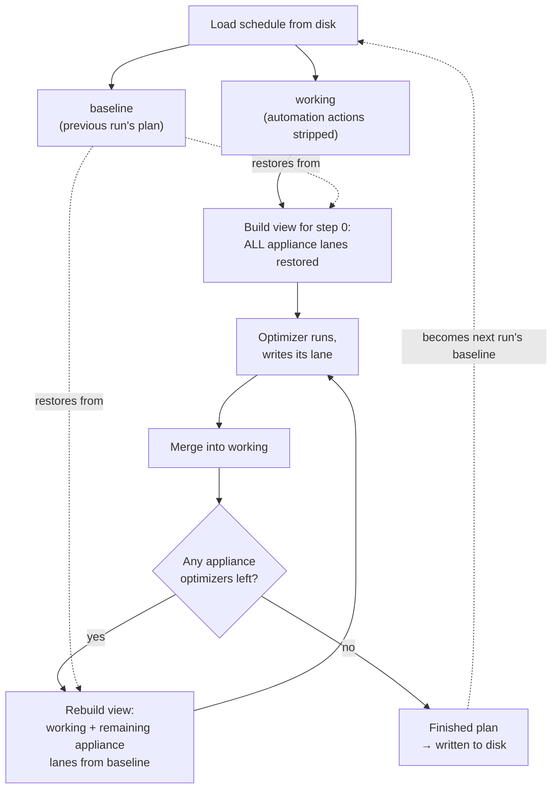
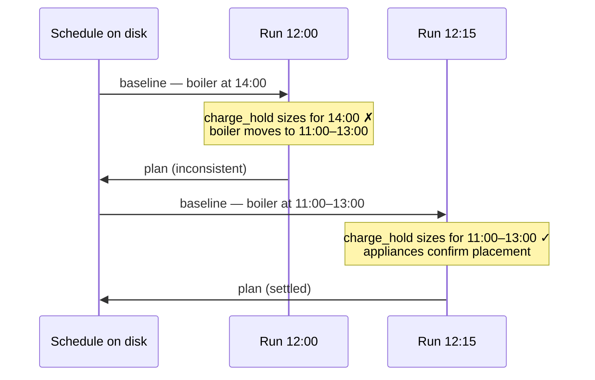

# How Helman plans

Helman does not produce a schedule in one shot. It re-plans continuously, and every plan is built partly from the plan before it. This document explains that loop: what a run is, what it reads, and why the previous run's output is an input to the next one.

## The short version

A run wipes its own previous decisions and re-plans from scratch — but while re-planning, it reads the wiped plan back as a *forecast of house demand*. That sounds circular, and the reason it is not is the whole subject of this document.

## Part 1 — How it works

### A run, and when it happens

A run plans a **48-hour horizon** in **15-minute slots**, starting from now — not from midnight. A run at 15:20 plans from 15:15 through 15:15 the day after tomorrow, so the horizon straddles three calendar dates and slides forward continuously.

Runs are triggered by events, not by a fixed internal clock:

| Trigger | Mode | When |
| --- | --- | --- |
| Slot boundary | debounced | every `:00 / :15 / :30 / :45` — the heartbeat |
| User edits the schedule | immediate | you move something in the card |
| Execution switched on | immediate | |
| Live condition changed vs. plan | debounced | a condition entity flipped since the plan was stamped |
| A model finished training | debounced | appliance energy, house profile |

The slot boundary is the one that matters for understanding the loop: **in normal operation there is one run per 15-minute slot**, and each run reads the previous slot's plan.

### Optimizers run in order, each owning one lane

You configure a list of optimizers. Each one owns exactly one **lane** — one controllable it is allowed to write:

| Kind | Lane | What it decides |
| --- | --- | --- |
| `charge_hold` | inverter | which slots to charge the battery in, so the rest is exported at better prices |
| `charge_from_grid` | inverter | whether to buy cheap grid energy ahead of an expensive window |
| `export_price` | inverter | when to stop exporting because the price is too low |
| `appliance_runtime` | one appliance | when that appliance runs, and for how long |

They run **in the order you configured them**, one after another. There is no hard-coded priority — position in the list is the priority.

### Two documents: baseline and working

Every run starts by loading the schedule currently on disk and immediately making two copies of it:

```
   schedule on disk (what the last run wrote, plus your manual edits)
            │
            ├──────────────────────► baseline    — kept intact, read-only
            │
            └── strip automation ───► working    — blank slate, this run builds here
                    actions
```

**Baseline** is the previous run's output, untouched. **Working** is the same thing with every automation-owned action removed — a clean sheet. Your own manual actions are never stripped and survive in both.

Stripping is necessary: without it, yesterday's stale decisions would leak into today's plan and never get re-evaluated. Each run genuinely re-plans everything from nothing.

### The problem stripping creates

Stripping is right for *writing* and wrong for *reading*.

An optimizer decides by looking at **surplus** — roughly `solar − house demand`. But after stripping, the working document says the house consumes nothing beyond its baseline load, because every appliance's planned run was just deleted.

So `charge_hold`, running first, would see a house with no washing machine, no dishwasher and no boiler in it — and conclude there is far more surplus available than there really is. It would size the day's battery charge against surplus that three appliances were about to eat. This was a real bug (issue #116).

The mistake is a conflation:

- **Writing** a lane is sequential. Optimizer 3 writes after optimizer 2. That ordering is real and intended.
- **Reading** house demand is not. Your house does not consume less electricity because the boiler's optimizer happens to sit fourth in a list.

### The fix: pending lanes are restored from the baseline

Before each optimizer runs, Helman rebuilds its view of the house. Any **appliance** lane belonging to an optimizer that has not run yet is taken back from the baseline — last run's placement for that appliance is put back into the demand picture.

So optimizer N sees a house built from three sources:

| Source | Contributes | Freshness |
| --- | --- | --- |
| Optimizers before it | their real writes from **this** run | fresh |
| Its own lane | nothing — it is re-planning it | empty by design |
| Appliance optimizers after it | their lanes from the **previous** run | stale proxy |
| Your manual actions | always present | fresh |

Nothing is being predicted here. A washing machine scheduled for 12:00 five minutes ago is a **fact on disk**, not a guess. The restore simply declines to pretend it isn't there.

Three rules keep this honest:

- **Only appliance lanes are restored.** Inverter lanes stay stripped, because that is what the battery optimizers are re-planning — restoring it would hand them their own previous holds as if they were fixed. It is also unnecessary: inverter actions move the battery, not the house's baseline consumption.
- **Never the optimizer's own lane.** It would read its own previous placements as fixed and never move.
- **Fresh always beats baseline.** A lane already re-planned this run keeps its new actions.

### The loop



Two things to notice.

**Nothing is threaded between optimizers except the schedule itself.** There is no running "surplus budget" being decremented. After each write, the *entire* forecast projection is recomputed from scratch over the updated document. Surplus is always a fresh derived reading, never an accumulator.

**The plan feeds back into itself across runs.** This run's output is next run's baseline. The system is an iterative loop — but the iterations are spread across runs, one per slot, not nested inside a single run.

### What is frozen during a run

All live values — forecasts, battery SoC, condition evaluations — are read **once** at the start of a run and reused for every rebuild within it. A run is a single consistent snapshot of the world. It cannot react to something that changes halfway through; it reacts on the next run.

## Part 2 — Worked examples

A shared setup for all of them. Optimizers in this order:

```
1. charge_hold     (inverter)
2. washer          (appliance, 1.0 kWh)
3. dishwasher      (appliance, 0.8 kWh)
4. boiler          (appliance, 2.0 kWh)
```

The previous run placed washer at 12:00, dishwasher at 13:00, boiler at 14:00. Figures are kWh per hour, aggregated from 15-minute slots for readability.

### Example 1 — A normal sunny day

The raw forecast, before anybody's decisions:

```
hour          11:00  12:00  13:00  14:00  15:00
solar          2.4    3.1    3.0    2.6    1.5
house base     0.6    0.6    0.6    0.6    0.6
─────────────────────────────────────────────────
bare surplus   1.8    2.5    2.4    2.0    0.9
```

Nobody ever sees that bottom row. Here is what each optimizer actually sees.

**Step 1 — `charge_hold`.** All three appliances are still pending, so all three come back from the baseline at last run's slots:

```
              11:00  12:00  13:00  14:00  15:00
bare surplus   1.8    2.5    2.4    2.0    0.9
washer          ·    -1.0     ·      ·      ·     ← baseline
dishwasher      ·      ·    -0.8     ·      ·     ← baseline
boiler          ·      ·      ·    -2.0     ·     ← baseline
─────────────────────────────────────────────────
SEES           1.8    1.5    1.6    0.0    0.9
```

Total surplus it can plan against: **5.8 kWh**, not 9.6 kWh. Without the restore it would have sized the day's charge against 9.6 kWh and come up short by exactly the 3.8 kWh the appliances were about to consume.

**Step 2 — `washer`.** Its own lane is empty. Dishwasher and boiler still come from the baseline.

```
              11:00  12:00  13:00  14:00  15:00
SEES           1.8    2.5    1.6    0.0    0.9    → picks 12:00
```

Note 12:00 is back to 2.5 — its own previous placement is correctly absent, so it is free to move.

**Step 3 — `dishwasher`.** The washer's fresh decision is now real; only the boiler is still stale.

```
              11:00  12:00  13:00  14:00  15:00
washer          ·    -1.0     ·      ·      ·     ← FRESH, this run
boiler          ·      ·      ·    -2.0     ·     ← baseline
─────────────────────────────────────────────────
SEES           1.8    1.5    2.4    0.0    0.9    → picks 13:00
```

It avoids stacking on the washer because it can see it.

**Step 4 — `boiler`.** Nothing is pending. Everything it sees is this run's real decisions.

```
              11:00  12:00  13:00  14:00  15:00
washer          ·    -1.0     ·      ·      ·     ← FRESH
dishwasher      ·      ·    -0.8     ·      ·     ← FRESH
─────────────────────────────────────────────────
SEES           1.8    1.5    1.6    2.0    0.9    → picks 14:00
```

The plan is unchanged from the baseline, so the system has settled. The next run will read this plan back and reach the same answer.

### Example 2 — Negative export prices

Spot prices go negative between 12:00 and 14:00: you are paid to consume and charged to export.

Two things should happen — stop exporting, and soak up as much as possible — and they are owned by different optimizers.

`export_price` stops the export. That is an **inverter** lane action, so it is not restored for pending optimizers. It does not need to be: stopping export does not change what the house consumes, and surplus is `solar − house demand`. The appliance optimizers' view is unaffected, which is correct.

The appliances are the part that matters here, and ordering shows up clearly. With negative prices, all three want the same hours:

```
              11:00  12:00  13:00  14:00  15:00
export price   0.04  -0.02  -0.03  -0.01   0.05   €/kWh
```

**Step 2 — `washer`** sees 13:00 as the most negative hour and takes it.

**Step 3 — `dishwasher`** now sees the washer parked at 13:00. Whether it joins it or moves to 12:00 depends on the surplus left and its own limits — but it is making that call against a house that already includes the washer, not against an empty one.

**Step 4 — `boiler`**, the 2.0 kWh load, sees both. It places against what genuinely remains.

If the restore did not exist, all three would independently pick 13:00 seeing a bare house, and `charge_hold` before them would have planned as though 3.8 kWh of negative-priced consumption were free surplus to sell.

Worth noting: in this window `charge_hold`'s normal logic inverts. Its job is to keep the battery out of charging where surplus is worth more exported — but at a negative price, exporting *costs* money, so charging is strictly better. It reaches that conclusion from the price rail, and it does so having already seen the appliance load that will compete for the same energy.

### Example 3 — Not enough sun

An overcast day. Solar barely covers the baseline house load.

```
hour          11:00  12:00  13:00  14:00  15:00
solar          0.7    0.9    0.8    0.6    0.4
house base     0.6    0.6    0.6    0.6    0.6
─────────────────────────────────────────────────
bare surplus   0.1    0.3    0.2    0.0    0.0
```

There is no surplus to distribute. Everything an appliance runs will come from the battery or the grid, so placement is decided by price and by the self-sustainability limits rather than by solar coverage.

The restore still does real work, through a different channel. `charge_from_grid` does not read surplus at all — it reads the **projected battery SoC trajectory** and decides whether an expensive import window needs bridging with cheap energy bought beforehand. That trajectory is built from the same house-demand picture. So:

- **With** the restore, `charge_from_grid` projects the battery *including* 3.8 kWh of appliance load it has not planned yet, sees it dip below the reserve floor during the evening peak, and buys enough cheap energy beforehand to bridge it.
- **Without** it, the battery looks 3.8 kWh healthier than it will be, no bridge is bought, and the evening peak is covered at peak import prices.

The same applies to the self-sustainability check, which re-simulates the whole 48-hour battery horizon per candidate placement. It is simulating a house that includes the other appliances, not an empty one.

On a deficit day these effects are larger than on a sunny one, because there is no surplus cushion absorbing the error.

### Example 4 — An appliance moves, and the plan converges over two runs

This is the one case where the previous run's plan is genuinely *wrong* rather than merely old.

At 11:45 the boiler is planned for 14:00. At 12:00 you raise its target temperature, so it now needs 3 hours instead of 2 and its cheapest window shifts to 11:00–13:00.

**Run at 12:00.**

`charge_hold` runs first and restores the boiler at **14:00** — last run's placement. It sizes the day's charge on that basis. Then the boiler optimizer runs, applies its new requirement, and places itself at 11:00–13:00 instead.

The plan is now internally inconsistent: `charge_hold` reserved charging slots assuming 2.0 kWh of load at 14:00 that will not happen, and assuming 11:00–13:00 was free when it no longer is.

**Run at 12:15.**

`charge_hold` restores the boiler at its **new** 11:00–13:00 placement, because that is what is on disk now. It re-sizes correctly. The appliances re-place against the corrected holds, land in the same slots, and the plan settles.



**The cost of the inconsistency is one slot — at most 15 minutes.** It self-corrects on the next run without anyone intervening.

This is the loop's defining property: it converges **across runs**, not within one. A plan read immediately after you change something is one iteration in, not settled. That is worth remembering when a plan looks odd right after an edit — look again after the next slot boundary.

### Example 5 — Cold start

Right after a restart, or the first run after you add a new appliance, there is no baseline for that lane. Nothing can be restored, so the pending appliances contribute nothing to demand, and `charge_hold` sees the full inflated surplus — the original issue #116 behaviour.

This is the one case with no correction available within the run. It resolves on the next run, once the appliance has a placement on disk to restore from, so the exposure is a single slot.

## Part 3 — Quick reference

### Where this lives in the code

| What | Where |
| --- | --- |
| The run loop | `automation/pipeline.py` — `run_optimizer_loop_pure` |
| Which lanes are pending per step | `automation/pipeline.py` — `_pending_appliance_ids_by_index` |
| Rebuilding the view for one step | `automation/pipeline.py` — `_build_pending_aware_snapshot` |
| Strip / restore mechanics | `automation/ownership.py` |
| Recomputing surplus and SoC | `coordinator.py` — `_build_automation_snapshot_from_schedule_pure` |
| Reading surplus | `automation/rails.py` |
| Run triggers | `automation/triggers.py`, `coordinator.py` |
| Horizon and slot size | `const.py` — `SCHEDULE_HORIZON_HOURS`, `SCHEDULE_SLOT_MINUTES` |

### Things that surprise people

- **The horizon is not a calendar day.** It slides with the clock. "Tomorrow" in a plan means "24–48 hours from now".
- **Optimizer order is priority.** Earlier optimizers get first claim on surplus. Reordering the list changes the plan.
- **An optimizer sees appliances that run after it.** Not their future decisions — their previous placements. This is intentional.
- **Inverter lanes are not restored, appliance lanes are.** Only house consumption needs to be whole for surplus to be right.
- **The plan settles across runs.** Don't judge a plan by the run immediately following a change.
- **A run cannot react to mid-run changes.** All inputs are frozen at run start.
