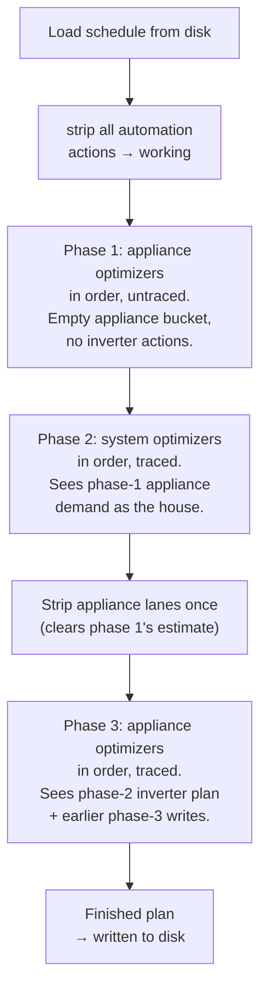

# How Helman plans

Helman does not produce a schedule in one shot. Each run wipes its own previous decisions and re-plans from nothing — the previous run's plan is never read back as an input. This document explains how a run does that: what it reads, in what order, and why the result does not depend on what was on disk beforehand.

## The short version

A run strips every automation-owned action and re-plans from a bare house, in three ordered phases: appliances estimate demand, the battery plans against that estimate, then appliances re-plan against the battery's decisions. Nothing from a previous run's plan is ever restored — the same inputs always produce the same output, whatever was on disk before.

## Part 1 — How it works

### A run, and when it happens

A run plans a **48-hour horizon** in **15-minute slots**, starting from now — not from midnight. A run at 15:20 plans from 15:15 through 15:15 the day after tomorrow, so the horizon straddles three calendar dates and slides forward continuously.

Runs are triggered by events, not by a fixed internal clock:

| Trigger | Mode | When |
| --- | --- | --- |
| Slot boundary | debounced | every `:00 / :15 / :30 / :45` — the heartbeat |
| User edits the schedule | immediate | you move something in the card |
| Execution switched on | immediate | |
| Live condition changed vs. plan | debounced | a condition entity flipped since the plan was stamped |
| A model finished training | debounced | appliance energy, house profile |

The slot boundary is the one that matters for understanding the loop: **in normal operation there is one run per 15-minute slot**, and each run reads the previous slot's plan.

### Optimizers run in order, each owning one lane

You configure a list of optimizers. Each one owns exactly one **lane** — one controllable it is allowed to write:

| Kind | Lane | What it decides |
| --- | --- | --- |
| `charge_hold` | inverter | which slots to charge the battery in, so the rest is exported at better prices |
| `charge_from_grid` | inverter | whether to buy cheap grid energy ahead of an expensive window |
| `export_price` | inverter | when to stop exporting because the price is too low |
| `appliance_runtime` | one appliance | when that appliance runs, and for how long |

They run **in the order you configured them**, one after another. There is no hard-coded priority — position in the list is the priority. Order is scoped to two separate buckets, not one flat list: **appliance optimizers** (`appliance_runtime`) and **system optimizers** (`charge_hold`, `charge_from_grid`, `export_price` — the inverter lane). Membership is derived from what each kind affects, never a hand-written list; you order each bucket independently, but the bucket a kind belongs to is fixed.

### One document, stripped once

Every run starts by loading the schedule currently on disk and stripping every automation-owned action from it:

```
   schedule on disk (what the last run wrote, plus your manual edits)
            │
            └── strip automation ───► working    — blank slate, this run builds here
                    actions
```

Your own manual actions are never stripped and survive untouched. What was on disk before this strip plays no further part in the run — there is no baseline document threaded through the loop, and nothing is ever restored from it. (A copy is still kept locally for two narrow, run-scoped purposes unrelated to planning: deciding whether the finished plan is byte-identical to what was already on disk, and a fast path when no optimizer is configured at all. Neither feeds a single decision an optimizer makes.)

Stripping is necessary: without it, yesterday's stale decisions would leak into today's plan and never get re-evaluated. Each run genuinely re-plans everything from nothing — and, since #272, from nothing *observable from the previous run*, not merely nothing on its own lane.

### The problem a single flat pass creates

An optimizer decides by looking at **surplus** — roughly `solar − house demand`. On a bare, freshly stripped house, house demand is wrong for anyone who hasn't placed their appliance yet: it is missing every appliance load that has not run this pass.

A single flat pass over one ordered list cannot fix this without looking backwards, because "looking backwards" only has one thing to look at: what a *previous run* decided. That is exactly the mistake issue #116 made and #272 removes — the previous run's plan being read as a proxy for what this run's appliances are *about* to decide. It gets the ordering backwards (a later appliance's fresh decision is more trustworthy than an earlier run's placement) and leaves cold start — no previous plan at all — with no correction whatsoever.

The actual fix is not a better proxy. It is running the appliance optimizers **twice**: once to produce a real demand estimate before the battery plans, and once more, for real, after.

### The fix: three ordered phases

| Phase | Runs | Sees | Traced |
| --- | --- | --- | --- |
| 1 | appliance optimizers, in order | earlier appliances only, in this run; no inverter actions | no |
| 2 | system optimizers, in order | the total phase-1 appliance demand | yes |
| 3 | appliance optimizers, in order, again | earlier appliances (this phase) + the phase-2 inverter plan | yes |

Phase 1 is a real run of every appliance optimizer against an empty appliance bucket and no inverter actions — not a restore, not a guess. It produces a genuine, if provisional, placement for every appliance, and the system optimizers in phase 2 read the *sum* of those placements as house demand. Phase 3 then strips the appliance lanes once — clearing phase 1's estimate — and re-plans each appliance for real, this time able to see the battery's phase-2 decisions (a `charge_hold` slot, a `charge_from_grid` bridge). Two optimizers on the same appliance lane compose in list order within a phase exactly as they did before: the later one sees the earlier one's writes and may extend or overwrite them.

Only phases 2 and 3 are traced and reported in the run's explanation. Phase 1 is a demand estimate, not a decision anyone should read as "the plan" — its placements are superseded by phase 3 before the run ends, and every optimizer contributes exactly one trace step and one day-context band regardless, keyed for phase 3's reading.

### The loop



Two things to notice.

**Nothing is threaded between optimizers except the schedule itself.** There is no running "surplus budget" being decremented, and there is no cross-run feedback loop either. After each write, the *entire* forecast projection is recomputed from scratch over the updated document. Surplus is always a fresh derived reading, never an accumulator, and it is always derived from what this run itself has decided so far — never from what a previous run decided.

**The result no longer depends on what was on disk beforehand.** Holding every other input fixed — forecasts, prices, live state, condition history — and varying only the prior plan's content produces a byte-identical document. The loop that used to span runs (a plan settling over several 15-minute slots) is now contained entirely within one run's three phases.

### What is frozen during a run

All live values — forecasts, battery SoC, condition evaluations — are read **once** at the start of a run and reused for every rebuild within it. A run is a single consistent snapshot of the world. It cannot react to something that changes halfway through; it reacts on the next run.

## Part 2 — Worked examples

A shared setup for all of them:

```
system bucket:     charge_hold
appliance bucket:  1. washer      (1.0 kWh)
                   2. dishwasher  (0.8 kWh)
                   3. boiler      (2.0 kWh)
```

There is no previous plan in play anywhere below — every example starts from the same bare, freshly stripped house, because that is what every run now starts from. Figures are kWh per hour, aggregated from 15-minute slots for readability.

### Example 1 — A normal sunny day

The raw forecast, before anybody's decisions:

```
hour          11:00  12:00  13:00  14:00  15:00
solar          2.4    3.1    3.0    2.6    1.5
house base     0.6    0.6    0.6    0.6    0.6
─────────────────────────────────────────────────
bare surplus   1.8    2.5    2.4    2.0    0.9
```

Nobody ever sees that bottom row. Here is what each phase actually sees.

**Phase 1, step 1 — `washer`.** Nothing has run yet; the appliance bucket is empty and there is no inverter action either.

```
              11:00  12:00  13:00  14:00  15:00
SEES           1.8    2.5    2.4    2.0    0.9    → picks 12:00
```

**Phase 1, step 2 — `dishwasher`.** Sees the washer's phase-1 placement, nothing else.

```
              11:00  12:00  13:00  14:00  15:00
washer          ·    -1.0     ·      ·      ·     ← phase 1
─────────────────────────────────────────────────
SEES           1.8    1.5    2.4    2.0    0.9    → picks 13:00
```

**Phase 1, step 3 — `boiler`.** Sees washer and dishwasher's phase-1 placements.

```
              11:00  12:00  13:00  14:00  15:00
washer          ·    -1.0     ·      ·      ·     ← phase 1
dishwasher      ·      ·    -0.8     ·      ·     ← phase 1
─────────────────────────────────────────────────
SEES           1.8    1.5    1.6    2.0    0.9    → picks 14:00
```

**Phase 2 — `charge_hold`.** Sees the *total* phase-1 appliance demand as the house, all at once — not built up one restored lane at a time:

```
              11:00  12:00  13:00  14:00  15:00
bare surplus   1.8    2.5    2.4    2.0    0.9
washer          ·    -1.0     ·      ·      ·     ← phase 1
dishwasher      ·      ·    -0.8     ·      ·     ← phase 1
boiler          ·      ·      ·    -2.0     ·     ← phase 1
─────────────────────────────────────────────────
SEES           1.8    1.5    1.6    0.0    0.9
```

Total surplus it can plan against: **5.8 kWh**, not 9.6 kWh — this run's own appliance demand, not a proxy borrowed from the last one. It places no holds here; there is nothing to bridge.

**Phase 3.** The appliance lanes are stripped once, clearing phase 1's estimate, and each appliance re-plans in the same order — now able to see `charge_hold`'s phase-2 writes too, of which there are none in this example. Reading the same demand phase 1 already established, each appliance lands in the same slot: washer at 12:00, dishwasher at 13:00, boiler at 14:00. The plan is settled within this one run, not across several.

### Example 2 — Negative export prices

Spot prices go negative between 12:00 and 14:00: you are paid to consume and charged to export.

Two things should happen — stop exporting, and soak up as much as possible — and they are owned by different optimizers.

`export_price` runs in phase 2 (system bucket) and stops the export. `export_price` reads only prices and eligibility — no phase can invalidate that decision, since it never reads appliance demand at all.

The appliances are the part that matters here, and ordering shows up clearly, entirely within phase 1 and confirmed in phase 3. With negative prices, all three want the same hours:

```
              11:00  12:00  13:00  14:00  15:00
export price   0.04  -0.02  -0.03  -0.01   0.05   €/kWh
```

**Phase 1, `washer`** sees 13:00 as the most negative hour and takes it.

**Phase 1, `dishwasher`** now sees the washer parked at 13:00. Whether it joins it or moves to 12:00 depends on the surplus left and its own limits — but it is making that call against a house that already includes the washer, not against an empty one.

**Phase 1, `boiler`**, the 2.0 kWh load, sees both. It places against what genuinely remains.

By stated order, not order plus leftover occupancy from a previous run: reordering the appliance bucket changes who gets first pick, and nothing else does.

Worth noting: `charge_hold`'s normal logic inverts here. Its job is to keep the battery out of charging where surplus is worth more exported — but at a negative price, exporting *costs* money, so charging is strictly better. It reaches that conclusion from the price rail in phase 2, having already seen the total appliance load phase 1 committed to the same hours.

### Example 3 — Not enough sun

An overcast day. Solar barely covers the baseline house load.

```
hour          11:00  12:00  13:00  14:00  15:00
solar          0.7    0.9    0.8    0.6    0.4
house base     0.6    0.6    0.6    0.6    0.6
─────────────────────────────────────────────────
bare surplus   0.1    0.3    0.2    0.0    0.0
```

There is no surplus to distribute. Everything an appliance runs will come from the battery or the grid, so placement is decided by price and by the self-sustainability limits rather than by solar coverage.

Phase 1 still does the same real work here, through a different channel. `charge_from_grid` does not read surplus at all — it reads the **projected battery SoC trajectory** and decides whether an expensive import window needs bridging with cheap energy bought beforehand. That trajectory is built from phase 1's appliance demand:

- It projects the battery *including* the 3.8 kWh of appliance load phase 1 placed, sees it dip below the reserve floor during the evening peak, and buys enough cheap energy beforehand to bridge it.
- Had phase 1 not run first — a bare house instead — the battery would look 3.8 kWh healthier than it will be, no bridge would be bought, and the evening peak would be covered at peak import prices. That is exactly issue #116, and it is what running appliances for real in phase 1 (rather than restoring a previous run's placement) closes for cold start too — see Example 5.

The same applies to the self-sustainability check, which re-simulates the whole 48-hour battery horizon per candidate placement in phase 2. It is simulating a house that includes phase 1's appliance demand, not an empty one.

On a deficit day these effects are larger than on a sunny one, because there is no surplus cushion absorbing the error.

### Example 4 — Reading the boiler's mid-day change

At 11:45 the boiler is planned for 14:00. At 12:00 you raise its target temperature, so it now needs 3 hours instead of 2 and its cheapest window shifts to 11:00–13:00. The run at 12:00 sees the new requirement immediately, because it is not reading anything from the run at 11:45 — every run re-derives the boiler's requirement from its live target, independent of what any previous run decided.

Phase 1 places the boiler at 11:00–13:00 under the new requirement. Phase 2 (`charge_hold`) sizes the day's charge against that placement, not against 14:00. Phase 3 re-plans the boiler and, seeing nothing from `charge_hold` that conflicts, confirms 11:00–13:00. The plan is internally consistent within this one run — there is no analogue of the old "one slot of inconsistency, corrected next run" transition, because there is no cross-run state left for the change to be inconsistent with.

### Example 5 — Cold start

Right after a restart, or the first run after you add a new appliance, there was — under the old baseline-restore model — no previous plan to restore from, so the pending appliances contributed nothing to demand and `charge_hold` saw the full inflated surplus: the original issue #116 behaviour, with no correction available until the next run.

Under the phased run this scenario is not special at all. Phase 1 runs the appliance optimizers for real regardless of whether anything existed on disk before — an empty appliance bucket at the start of phase 1 is exactly what every run starts from, cold or not. `charge_hold` in phase 2 reads phase 1's real placements the same way it always does. The fix for this scenario and the fix for the general case are the same fix: cold start is correct on the very first run.

### Example 6 — A phase-2 hold can still be undercut in phase 3

Overcast day, an expensive import window at 17:00–20:00, `reserve_floor_soc` at 20%.

Phase 1 places the boiler at 13:00. Phase 2 (`charge_from_grid`) projects the battery's minimum SoC across the window at 24% including that placement, so the projected dip is non-negative and it buys nothing. Phase 3, now able to see `charge_hold`'s holds, moves the boiler to 18:00 — inside the expensive window, because from the appliance optimizer's own perspective that is a better price-for-runtime trade. The projected minimum for the window is now 16%: the plan ships breaching the reserve floor by 4 points.

This is not a regression introduced by phasing. It is the **same hazard** the single-pass pipeline already had — there, the equivalent trigger was the boiler having sat at 13:00 in the *previous* run's plan and moving in *this* run, for the same underlying reason: the optimizer sizing the hold cannot see a placement decided after it. Phasing does not close this; #274 classifies it (a `downstream_introduced` reserve-floor breach, in the vocabulary of that classifier) and #272 re-runs that classifier's scenario suite to confirm phasing does not make it more frequent or more severe. The repair — giving phase 2 visibility into what phase 3 might still move, or re-checking the floor after phase 3 — is deliberately a separate, later piece of work.

## Part 3 — Quick reference

### Where this lives in the code

| What | Where |
| --- | --- |
| The run loop, all three phases | `automation/pipeline.py` — `run_optimizer_loop_pure` |
| One optimizer step, shared by every phase | `automation/pipeline.py` — `_run_optimizer_step` |
| Appliance vs. system bucket membership | `automation/spec.py` — `OptimizerSpec.bucket`; config-level lists on `AutomationConfig.enabled_appliance_optimizers` / `enabled_system_optimizers` |
| Strip mechanics (whole-run and phase-3 narrowed) | `automation/ownership.py` — `strip_automation_owned_actions` |
| Recomputing surplus and SoC | `coordinator.py` — `_build_automation_snapshot_from_schedule_pure` |
| Reading surplus | `automation/rails.py` |
| Run triggers | `automation/triggers.py`, `coordinator.py` |
| Horizon and slot size | `const.py` — `SCHEDULE_HORIZON_HOURS`, `SCHEDULE_SLOT_MINUTES` |
| Reserve-floor breach classification | `automation/reserve_floor_classifier.py` |

### Things that surprise people

- **The horizon is not a calendar day.** It slides with the clock. "Tomorrow" in a plan means "24–48 hours from now".
- **Optimizer order is priority, within a bucket.** Earlier optimizers in a bucket get first claim; reordering that bucket's list changes the plan. The two buckets themselves always run appliance → system → appliance, not in a user-configurable order.
- **An appliance optimizer sees only appliances before it, in its own phase.** Nothing from a previous run, and nothing from later in the same phase.
- **Appliance optimizers run twice.** Once in phase 1 to estimate demand for the system bucket, once in phase 3 to place for real against the system bucket's decisions. Only phase 3's placement is what ships; phase 1 is invisible in the run's explanation.
- **The result no longer depends on what was on disk before the run.** Same forecasts, prices, live state and history in, same document out — whatever the previous plan contained.
- **A run cannot react to mid-run changes.** All inputs are frozen at run start.
- **The reserve-floor hazard is not fixed by this.** Phase 3 can still move an appliance into a window `charge_hold` sized before seeing that move. It is classified (`automation/reserve_floor_classifier.py`), not repaired — see Example 6.
