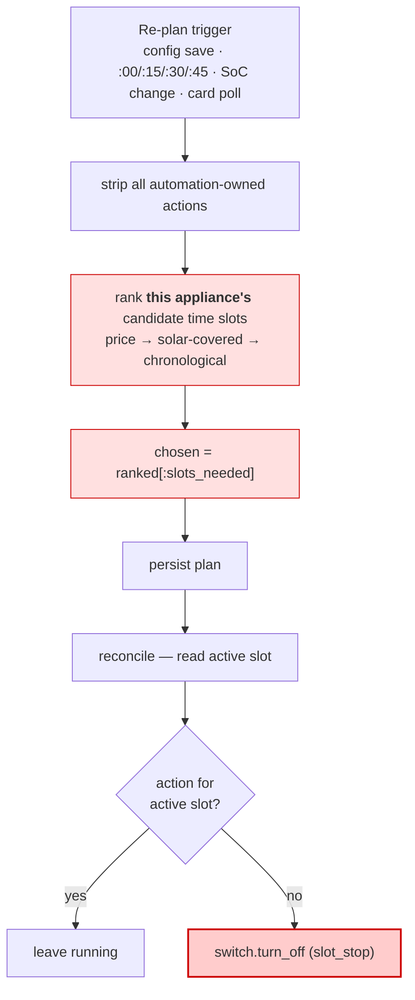
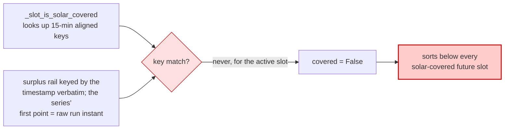
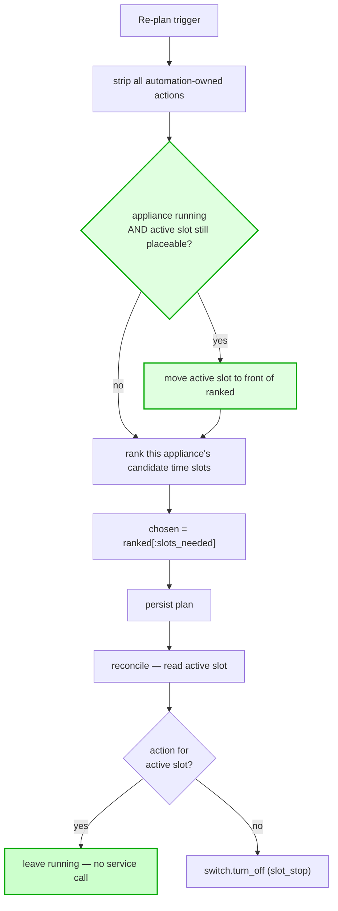

# Active-slot commitment

Appliances are switched off mid-run and switched back on minutes later. This
describes why, and the one change that stops it.

## Symptom

`switch.jistic_bazen_filtrace` (pool filtration, the only enabled appliance
optimizer), two days of recorder history:

```
07-26  11:55:52 off  →  11:55:53 on      1 second
       15:28:05 off  →  15:28:08 on      3 seconds
       16:53:20 off  →  17:00:33 on      7 minutes
07-27  10:37:31 off  →  10:37:33 on      2 seconds
       13:34:47 off  →  13:34:49 on      2 seconds
       13:55:11 off  →  14:46:02 on      51 minutes
       17:07:21 off  →  17:07:22 on      1 second
```

Two things follow immediately. It is **not** caused by saving config — these are
fourteen events across two days. And an off followed by an on *one second later*
cannot be a real change in prices, forecast or schedule: it is two consecutive
planning runs disagreeing about whether the slot currently being executed
belongs in the plan.

## Root cause

> **A slot that is already executing has no standing in the plan.**

The optimizer honours exactly one kind of immutability — user ownership
(`appliance_runtime.py:514`). An automation-owned action that is *physically
running right now* is ordinary re-derivable input. Every re-plan strips the
previous plan and re-derives every slot from scratch, so any re-plan may revoke
a run in flight — and the executor faithfully turns that revocation into
`switch.turn_off`.

### The algorithm, in full

Each `appliance_runtime` optimizer plans **one appliance, independently**. Every
run it does this from scratch:

1. take every eligible half-hour slot left today
2. sort them cheapest-first
3. `slots_needed = ceil(remaining_hours / 0.5)`
4. take that many off the top — everything else is simply not scheduled

Note what is absent: nothing in it knows the appliance is currently running.

> **The sort is over *time slots for a single appliance*, never between
> appliances.** Appliances do not compete for a ranking; each optimizer ranks
> its own appliance's candidate slots.

Worked example — 8 h/day target, 5.75 h already delivered, the time is 13:40 and
the pump is running in the 13:30 slot:

- `remaining = 2.25 h` → `slots_needed = 5`
- sorted: `14:00, 14:30, 15:00, 15:30, 16:00, … , 13:30`
- chosen = top 5 → **13:30 is not among them**

The executor reads "no action for the active slot" and switches the pump off at
13:40. Seven minutes later another run shifts the numbers slightly, 13:30 is back
in, pump on. That is the one-second blip.

## Current flow



The running slot enters the sort as an ordinary candidate and can fall past the
`[:slots_needed]` cut. When it does, the executor sees no action for the active
slot and stops the appliance.

### Why it is always the *running* slot that gets cut

Not bad luck — it is structurally last in the ranking:



The series' first point covers only the remainder of the bucket in progress and
is stamped with the raw run instant. `reference_time` is never aligned in
production — Home Assistant's `async_track_time_change` fires with a random
50–500 ms offset — so that key is one no caller can construct. Callers look
buckets up by flooring a slot start, so the bucket covering *now* always missed:
`available is None`, coverage returns `False`.

Ranking is `(price, covered, chronological)`; with flat or hourly-tied export
prices, `covered` *is* the ranking. The running slot therefore sat at the bottom
of the chosen set — exactly where the cut lands.

Fixed in `read_available_surplus_by_bucket` rather than in the forecast builder:
`read_soc_by_bucket_covering_horizon`, one function above it, already floors its
keys with `canonical_bucket_start`, so the surplus rail was the outlier. Fixing
the reader keeps the published series untouched and follows the convention the
sibling reader already sets.

It was untested because every test in
`test_automation_optimizer_appliance_runtime.py` uses an aligned
`REFERENCE_TIME` with future-only candidate slots.

### What makes it fire so often

| Input | Recomputed | Effect |
|---|---|---|
| `delivered_hours` | only at `:00/:15/:30/:45` (cached in the input bundle) | steps `slots_needed` down by one, mid-slot half the time |
| `available_surplus_by_bucket` | **every run**, from live battery SoC | flips `covered` for whole blocks of slots |

The second explains the one-second blips: two runs seconds apart see identical
`slots_needed` but a freshly recomputed `covered` set, so the bottom-ranked slot
— always the running one — drops and returns.

## New flow



## Why this helps

The in-flight slot is decided **before** ranking, so neither volatile input can
reach it: a `slots_needed` decrement and a reshuffled `covered` set now both cut
into future slots only. The executor is untouched — the `turn_off` at
`execution.py:620` still exists, it simply stops being asked for.

The fix is deliberately independent of *which* input moved. The one-second blips
show that in some cases essentially nothing moved, so the correct level to fix
this at is the commitment, not the input.

## The change

Two edits, ~15 lines.

**1. `coordinator.py`, `_async_gather_compute_inputs`** — add
`appliance_active_by_id` to `ComputeInputs`, read from `hass.states` using the
entity/active-states pair `_resolve_runtime_entity_and_states`
(`coordinator.py:173`) already returns. Mirrors the existing
`vehicle_remaining_capacity_kwh_by_vehicle_id` field and keeps the optimizer
loop pure and hass-free.

**2. `appliance_runtime.py:225-234`** — after `ranked = _rank_slots(...)`, if the
appliance is active and the current slot is in `plan.placeable_slots`, move it to
the front of `ranked` before the `[:slots_needed]` cut.

### Preserved semantics

- Stops at a slot boundary when the plan says so.
- Stops when `remaining_hours <= 0` (`appliance_runtime.py:174`).
- User-owned slots still win.
- Stops when the config genuinely makes the slot ineligible — it would not be in
  `placeable_slots`.
- Uncapped optimizers are unaffected: they place on every eligible slot and never
  rank.

## What the pin does **not** override

The pin touches ranking only. It is not immunity for the running slot, and both
condition mechanisms still stop the appliance mid-run — by design. It protects
against *the plan reshuffling for economic reasons*, never against *the world
changing*.

| Change | Route | Still stops the appliance? |
|---|---|---|
| `min_soc_pct` no longer holds | drops the slot from `system_mask`, so it leaves `placeable_slots` (`appliance_runtime.py:353-354`) — the pin is guarded on membership | **yes, immediately** |
| `when_price_below` no longer holds | same route | **yes** |
| `run_when` day no longer matches | same route | **yes** |
| `custom` condition goes false | does not touch the mask; sets `custom_met`, stamped as `condition_met=False` (`base.py:140-145`, `:184-186`), and `strip_candidate_actions` removes it before execution (`schedule_executor.py:529`) | **yes** — pinning a slot and stamping it a candidate are orthogonal |
| Daily minimum reached | `remaining_hours <= 0` early-out (`appliance_runtime.py:174`) | **yes** |
| Config makes the slot ineligible | leaves `placeable_slots` | **yes** |

### A stronger pin was considered and rejected

Carrying the currently-committed action through immutably — the way user-owned
actions are carried, `condition_met` stamp included — would also suppress
flicker caused by condition flips. It is rejected because `min_soc_pct` is a
*protective* rail: if the battery is projected to fall through its floor, the
appliance must stop now, not at the end of the current half-hour. A pin that
overrides it turns a safety rail into a suggestion.

If condition flips turn out to cause visible flapping in practice, that is a
separate problem with a separate fix — hysteresis on the condition evaluation,
not immunity for the running slot.

## The trade-off

With `slots_needed` fixed, promoting the current slot pushes out whatever would
otherwise have been the last chosen slot. So the appliance may run one half-hour
at a slightly worse price than the alternative.

Two things make this a good trade. The displaced slot is *marginal* by
construction — it is the last one above the cut. And because of the
timestamp-alignment bug below, the "cheaper" alternative frequently is not
genuinely cheaper: the current slot was demoted for a spurious reason, not a real
price signal. Fixing that bug reduces how often the pin overrides a real signal
rather than a fake one.

## Status

Implemented and merged to `main`:

| Commit | Change |
|---|---|
| `feat(automation): keep an in-flight appliance run in the plan` | the pin — `appliance_active_by_id` (A5) plus promotion before the cut |
| `fix(automation): key the surplus rail by canonical bucket start` | the surplus rail could not *find* the bucket in progress |
| `fix(automation): stop gating the slot in progress on elapsed SoC buckets` | `min_soc_pct` gated on a bucket that no longer exists |

Eight tests cover the three (pin kept when running, dropped when idle,
marginal-slot displacement, ineligible slot, minimum reached, still stamped a
candidate; the surplus rail under an unaligned reference time; the SoC mask past
a slot midpoint). Each was verified to fail with its change reverted.

### The third one was found by deploying

The first two were derived from the code. The third only surfaced when the fix
was watched against a live instance: with `min_soc_pct` configured, the slot in
progress left `placeable_slots` on every re-plan landing in the second half of a
slot — which is exactly where the pin's guard reads, so **the pin was inert
precisely when it was needed**. Two of the three defects are the same shape: a
rail that cannot describe the bucket in progress. The surplus rail failed to
find a bucket that existed; the SoC mask gated on one that legitimately no
longer does.

## Related, fix separately

**Empty condition masks.** `_export_price_below_mask` and `_run_when_mask`
(`conditions/types.py:104-130`, `:92-101`) return an empty mask when their rail
is missing, instead of raising `ConditionRailsUnavailable` — so they miss the
baseline-restore protection at `pipeline.py:586-593`. The class docstring states
the invariant they break: *"It must never degrade into 'no slots matched', which
would silently clear the appliance."* One line each. Live for the current config,
which uses `when_price_below: 1.5`.
