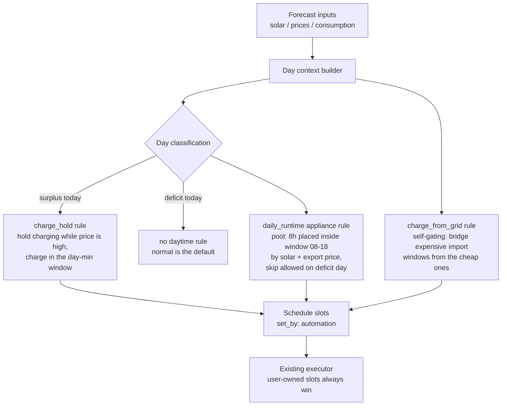

# Helman Automation - Day-Scoped Rules (Brainstorm)

Status: brainstorm, no implementation planned yet.

## The problem in one sentence

The current optimizers decide **slot by slot** ("is the export price in this slot below X?"),
but the way the house is actually operated is **day by day**: one look at the whole-day solar
and price forecast in the morning decides the shape of the entire day.

Because the automation cannot express that, it stays disabled and the day is authored manually.

## Guiding principle

**Self-sustainability is the priority; export revenue is a nice benefit, not an objective.**

Every rule below must be safe with respect to that ordering: a rule may capture export
value only with energy the house and battery provably (per forecast) do not need. When in
doubt — forecast uncertainty, shrinking margins — the rules fall back toward charging, not
toward exporting. Playing it safe and "leaving money on the table" is the intended
behavior, because it is exactly what the manual operation does today.

## The manual routine we want to encode

These are the real decisions currently made by hand every morning:

### Use case 1 - sunny day, morning export

- In the morning the export price is high.
- So: disable battery charging → surplus solar is exported to the grid.
- When the price drops to the **day minimum**, switch back to normal mode → battery charges
  from solar during the cheap window.

The decision is *relational within the day* ("the minimum of today's price curve"), not an
absolute threshold. A fixed `when_price_below` can never express "wait for today's cheapest
solar hours".

**Hard priority: the battery must get fully charged.** Exporting during the expensive
morning is only allowed with energy the battery *provably does not need* — provably per
forecast: the remaining solar surplus after the release point must still cover the
battery's charge gap. If waiting for the exact price minimum would leave too little sun
for a full charge, the hold must release earlier, even at a worse export price. (Reality
can still diverge from the forecast — that is accepted; the rule only has to be safe with
respect to the forecast it planned against.)

### Use case 2 - weak solar day, charge immediately

- One look at the whole-day solar prediction says there will not be enough sun.
- So: skip the export game entirely and charge from the very morning.

The trigger is the **day total** (predicted kWh for the day vs. what house + battery need),
not any single slot value.

**Resolved: this needs no rule of its own.** "Charge from the very morning" is just normal
mode from the start of the day — which is exactly what happens when `charge_hold` declines
to write anything (deficit classification). The default is already the right behavior; a
`day_mode` rule writing `normal` would be a no-op dressed up as a rule.

### Use case 3 - pool filtration

- Normally runs roughly 09:00–17:00 (solar hours).
- Constraint: at least ~8 hours per day.
- Flexibility: one day can be skipped entirely when solar is weak — the pool survives —
  but not two days in a row.

This mixes a **daily runtime budget**, a **preferred window**, and a **cross-day memory**
("did we already skip yesterday?").

### Use case 4 - charge from grid to bridge expensive import windows

- In winter, days are typically deeply deficit — solar cannot even power the house.
- The import price curve (which Helman already forecasts) alternates between cheap and
  expensive windows — typically cheap at night, expensive during the day, but the rule
  should read the curve, **not** assume fixed hours.
- Before the price goes up: check whether the battery SoC plus the expected solar can power
  the forecasted consumption **until the import price drops again**.
- If not: charge from the grid during the cheap window, to the level needed to bridge the
  whole expensive window — plus a reserve in case of a grid blackout.
- "Stop charging" is implicit: the cheap window ends and no further charge slots exist.

Two things make this different from the daytime rules: the target level is **computed from
the forecast** (net consumption over the expensive window), and the windows themselves are
derived from the shape of the **import** price curve rather than from clock times or a day
classification.

## What the current model cannot express

The pipeline itself (config-driven optimizers, ownership stamping, `set_by: automation`,
user overrides win) fits well and is worth keeping. The gaps are all in the *vocabulary*
available to optimizers:

| Manual decision | Missing capability |
| --- | --- |
| "wait for today's price minimum" | day-relative price comparison (min / percentile / rank within the day) |
| "not enough sun today" | day-aggregate solar signal (predicted kWh for the day) |
| "export first, then charge" | sequencing two phases within one day, driven by one classification |
| "pool ≥ 8 h/day, may skip a day" | daily runtime budget + skip allowance + memory of yesterday |
| "charge while cheap so battery + solar survive the expensive window" | cheap/expensive band detection on the import price curve + per-band energy-gap simulation |
| "decide once in the morning" | day-scoped decision that stays stable during the day instead of flip-flopping with every forecast refresh |

## Key idea: a shared "day context" + day-scoped rule kinds

Instead of jumping to a full planner (see `helman-automation-constraint-model.md` for that
direction), extend the existing pipeline with two things:

1. **Day context** — computed once per automation run, shared by all optimizers:
   - predicted solar total for today (and tomorrow) in kWh
   - expected house consumption total for today
   - day price curve statistics: min, max, per-slot rank/percentile, the slot window
     containing the day minimum
   - import price band detection: alternating cheap/expensive windows over the horizon
   - a resulting **day classification**, e.g. `surplus` / `tight` / `deficit`
2. **New optimizer kinds** that consume the day context and write whole windows of slots,
   not just per-slot reactions.

The day classification is the single load-bearing signal — it is literally the "one look at
the forecast" that currently happens in the user's head.

**Reuse the simulation, don't duplicate it.** The optimization snapshot already carries the
engine's simulated battery SoC trajectory (`batteryForecast`) and grid import/export flows
(`gridForecast`), built from solar, consumption, prices, *and the live starting SoC*.
Wherever a rule below says "simulate" or "check the SoC", it means **read these existing
per-slot outputs** — `solarKwh`, `baselineHouseKwh`, `chargedKwh`, `remainingEnergyKwh`,
`socPct`, `importedFromGridKwh`, `exportedToGridKwh`, `availableSurplusKwh` — never a
parallel hand-rolled solar/consumption model. Starting SoC therefore enters every decision
for free: a battery at 80% produces a visibly different simulated trajectory than one at
10%, and the rules react to the trajectory.

**Important timing caveat — the rebuild is *between* optimizers, not *within* one.** The
pipeline rebuilds the snapshot after each optimizer's `optimize()` returns, so a single
optimizer receives **one** input snapshot and returns **one** schedule. It cannot write a
candidate slot and ask the framework to re-simulate it mid-decision. Any rule that needs to
evaluate several candidate schedules (see `charge_hold`'s latest-safe-release below) must
therefore compute its answer in **one pass from the input snapshot's existing per-slot
series** — which already reflect the engine's simulated solar/house/charge-power behaviour —
rather than iterating candidate writes against re-simulations. This is still "reuse the
simulation": the per-slot numbers are the engine's, the rule only sums over them. Adding an
in-optimizer re-simulation callback to the contract is explicitly *not* pursued in v1
(YAGNI); the closed-form-over-series approach is sufficient.



### What a sunny vs. dark day would produce

```mermaid
gantt
    dateFormat HH:mm
    axisFormat %H:%M
    section Surplus day
    stop_charging (export at high price)   :a1, 07:00, 4h
    normal (charge in day-min window)      :a2, 11:00, 13h
    pool filtration 8h                     :a3, 09:00, 8h
    section Deficit day
    grid charge in cheap import window     :b0, 01:00, 4h
    no daytime slots written (normal)      :b1, 07:00, 17h
    pool skipped (if not skipped yesterday):crit, b2, 09:00, 8h
```



## Candidate rule kinds

Sketches only — names and params are up for discussion.

### `day_classifier` (shared input, not an optimizer)

**Decided: the classification compares predicted day solar against forecasted day
consumption** — not fixed kWh thresholds. Relative mode stays correct across seasons
without retuning.

```yaml
automation:
  day_context:
    # day classification = predicted solar total vs. forecasted consumption total
    deficit_below_ratio: 0.8    # solar < 80% of consumption → deficit
    surplus_above_ratio: 1.3    # solar > 130% of consumption → surplus
    # between the two → tight
```

**Starting SoC matters — and it comes from the simulation, not a third raw input.** A
battery at 80% is a different day than one at 10%, and the engine's grid import/export
forecast already accounts for that. So the classifier should read the baseline simulation
rather than only the raw solar/consumption ratio: simulated flows showing surplus export
and the battery reaching full → `surplus`; simulated imports during expensive hours →
`deficit`. The ratio remains the intuition behind the thresholds, but the computed signal
comes from the already-simulated flows so the logic is not duplicated.

### `charge_hold` (use case 1)

"On a surplus day, don't charge while the export price is still well above the day minimum;
release in the cheapest solar window — **but never so late that the battery can't fully
charge from the remaining forecast sun**."

```yaml
- id: morning-export
  kind: charge_hold
  params:
    only_on_days: [surplus]          # classification gate
    hold_action: stop_charging      # exported instead of charged
    release: day_price_min          # only ever moves the release earlier, never later
    window: { start: "06:00", end: "14:00" }  # never hold outside this
    battery_first:
      target_soc: 100               # what "charged" means for this rule
      margin_pct: 20                # configurable; tuned by observing real days
```

`margin_pct` is a plain config knob the user tunes from observation — no auto-calibration.
The solar forecast feeding this rule already passes through the existing bias-correction
engine, which should absorb most of the systematic error; the margin only has to cover the
residual.

Semantics: the effective release time is the **earlier** of two independent bounds:

1. the price-based release (the day-minimum price slot), and
2. the **latest safe release** derived from the forecast.

The price bound is deliberately not optimized further: it only ever moves the release
*earlier* than strictly necessary, never later. Concrete example of the intended behavior:
the day minimum is at 13:00 and the forecast says releasing as late as 15:00 would still
fully charge the battery — release at 13:00 anyway (play it safe, take the cheap window).
If a later forecast refresh shows the sun collapsing and 11:00 becomes the latest safe
release, release at 11:00 even though the price there is not the minimum. The battery wins
every conflict.

The latest safe release is the latest slot `t` for which the remaining charging energy of
the day still covers the battery's gap:

```
needed_kwh      = (target_soc - current_soc) × usable_capacity / charge_efficiency
surplus_after(t)= Σ over slots ≥ t of max(0, solar_kwh − house_kwh)   # capped by max charge power
latest safe release = max t such that surplus_after(t) ≥ needed_kwh × (1 + margin_pct/100)
```

**How to evaluate this without an in-optimizer re-simulation loop.** Because the pipeline
rebuilds the snapshot only *between* optimizers (see the timing caveat under "Reuse the
simulation" above), `charge_hold` cannot write a candidate release and read back a fresh
end-of-day SoC — it gets one input snapshot. The latest safe release is instead computed in
**one backward pass over the input snapshot's per-slot series**: `needed_kwh` from the
current `socPct` and target against usable capacity; `surplus_after(t)` by summing the
engine's per-slot `max(0, solarKwh − baselineHouseKwh)`, clipped each slot at the max charge
power. This still consumes the engine's simulated solar/house numbers — it does not
re-derive them — so it honours "reuse the simulation" while fitting the single-pass
optimizer contract. The final schedule is then re-simulated by the framework after the
optimizer returns, so it is still validated by the same engine that produces the forecast
views.

This needs three battery parameters — **max charge power, usable capacity, charge
efficiency** — that the forecast builder uses internally today but that are not yet on
`OptimizationContext`. Exposing them to optimizers is a small plumbing prerequisite for this
rule.

Corner cases that fall out naturally:

- If even releasing at the very start of the window can't fully charge the battery, there
  is no room for a charge hold at all → the rule writes nothing (and the day was probably
  classified `tight`/`deficit` anyway — but this check must hold independently, because the
  classification is coarser than this slot-level cumulative math).
- If the battery is already at target in the morning, `needed_kwh ≈ 0` and the hold can run
  as long as the price makes it worthwhile.
- The max-charge-power cap matters: a battery cannot absorb a whole day's surplus in one
  hour, so `surplus_after(t)` must clip each slot's contribution at what the battery can
  actually take in that slot.

On `tight`/`deficit` days the rule writes nothing.

**The rule only ever writes the hold, never `normal`.** Releasing means it *stops writing*
`stop_charging` — untouched slots materialize as `normal` anyway (and writing `normal`
would just delete the slot from storage). This keeps the release window free for other
rules to claim, which matters for the interplay below.

**Interplay with the existing `export_price` optimizer.** The two are complements on the
same price curve, not an overlap:

- `export_price` triggers on export price *below* a threshold (negative prices) and writes
  `stop_export` — protective, never dump energy at a loss.
- `charge_hold` triggers on export price relationally *high* within the day and writes
  `stop_charging` — opportunistic, sell the morning peak.

The conditions are mutually exclusive on the same signal, so on a given slot at most one of
the two *wants* to act. Note this is not a claim that they write different ownership keys:
both write the single-valued inverter action position `(slot_id, "inverter")`, and a slot
can hold only *one* action kind — `stop_charging` **or** `stop_export`, never both. So if
they ever did target the same slot, later config order simply replaces the earlier action
(see pipeline order below); they do not stack. In practice their intended slots differ, so
this only matters as a tie-break rule, not a routine collision. They also compose well: on a
sunny surplus day the price minimum
`charge_hold` releases into is often midday, when solar floods the market and prices can go
negative — exactly where `export_price` steps in with `stop_export` (battery still charges
from solar, nothing is exported at a loss). The composed day: morning `stop_charging`,
midday `stop_export`, everything else `normal`.

**Pipeline order: `charge_hold` before `export_price`.** Optimizers run sequentially over
the same working document, so the protective rule runs last and wins any residual conflict
— e.g. a below-threshold price slot inside the hold window, where exporting at a loss
while also not charging would be the worst of both worlds.

### Use case 2 needs no rule

On a deficit day the correct daytime behavior is that **no automation slots are written at
all**: `charge_hold` declines to run, missing slots materialize as `normal`, and the
battery charges from whatever sun there is from the very morning. The earlier idea of a
`day_mode` rule writing `normal` is dropped — writing the default explicitly is a no-op
and would only add ownership noise to the schedule.

### `charge_from_grid` (use case 4)

"Whenever the import price curve says an expensive window is coming and battery + solar
won't carry the house through it, charge from the grid during the cheap window before it —
just enough to bridge, plus the blackout reserve."

```yaml
- id: grid-bridge-charge
  kind: charge_from_grid
  params:
    reserve_floor_soc: 30           # blackout reserve — never plan below this
    margin_pct: 10                  # forecast headroom on the computed gap
    max_target_soc: 100             # optional cap below the battery max bound
```

No fixed hours and no classification gate — the rule is **self-gating**. Semantics, per
automation run over the horizon:

1. **Detect price bands.** Partition the import price forecast into alternating
   *cheap* / *expensive* windows. This starts super simple: the real tariff today is a
   two-level step curve (~7 CZK/kWh 06:00–22:00, ~5 CZK/kWh 22:00–06:00), so bands are
   just contiguous runs of the same price level — cheap = the lower level. Anything
   smarter (percentiles, hysteresis for spot-style curves) waits until the tariff actually
   gets that shape.
2. **Check each expensive window against the simulated trajectory.** Read the snapshot's
   simulated SoC through the window — it already plays forecasted consumption minus solar
   from the live starting SoC. If the simulated SoC never falls below `reserve_floor_soc`,
   the window is covered — do nothing.
3. **Compute the bridge target.** Otherwise the gap is how far the simulated trajectory
   dips below `reserve_floor_soc`; lift the window-start SoC by that dip, times the
   margin, capped at `max_target_soc`. If the window is too long to bridge even from a
   full battery, charge to the cap — partial bridging still displaces the most expensive
   hours.
4. **Place the charge.** In the cheap window preceding it, pick the cheapest import slots
   (enough, given max charge power, to reach the target) and write `charge_to_target_soc`.

On a sunny day step 2 finds every window covered and the rule writes nothing — which is
why no `only_on_days` gate is needed: the forecast math *is* the gate, at slot resolution
instead of a coarse day label.

Notes:

- The existing `charge_to_target_soc` action already has the right executor semantics
  (charges only while below target, then holds) — this rule only decides *where to put it*
  and *what target to write*.
- "Stop in the morning" needs no action: the cheap window's charge slots end and the
  schedule falls back to default `normal`.
- Slot picking stays simple: sort the cheap window's slots by price, take as many as the
  required energy needs, no contiguity requirement (the inverter does not care about gaps).
- Battery-first consistency: unlike `charge_hold` this rule has no safety tension — it
  only ever *adds* energy. `reserve_floor_soc` is a config floor, never a forecast output;
  the max SoC bound is already enforced by `set_schedule` validation.
- Clamp the written target to `[min_soc, max_soc]`. `set_schedule` validation rejects a
  `charge_to_target_soc` whose `target_soc` falls outside the configured battery SoC bounds,
  so the computed bridge target (and any `reserve_floor_soc` / `max_target_soc` derived from
  it) must be clamped into that range before the slot is written, or the whole automation
  run is rejected.
- Stability: like the classification, this rule can also churn if the forecast wobbles
  between runs (a different bridge target or a different set of cheap slots). It is
  low-stakes — already-elapsed slots are never rewritten and the rule only adds energy — so
  v1 does not freeze it, but this is a known and accepted source of mid-day re-planning.

### `daily_runtime` appliance rule (use case 3)

```yaml
- id: pool-filtration
  kind: daily_runtime
  params:
    appliance_id: pool-pump
    min_hours_per_day: 8
    window: { start: "08:00", end: "18:00" }   # must be >= min_hours_per_day wide
    skip:
      on_days: [deficit]
      max_consecutive_skips: 1
```

Semantics: the window is deliberately **wider than the runtime budget** (e.g. 8 hours
somewhere inside a 10-hour window), and the algorithm decides *which* slots inside it to
use, ranked by **expected solar energy and export price**: prefer slots where forecast
solar surplus covers the pump (free self-consumed energy), and among those prefer the
slots with the lowest export price (running the pump there forgoes the least export
value). On a `deficit` day the run may be skipped entirely — unless yesterday was already
skipped.

**No persisted cross-day state.** "Did it run yesterday, and for how long" is read from
the appliance's recorded history (HA recorder) instead of an own skip counter. That way
manual runs count automatically — a day where the user ran the pump by hand is a day the
pool was filtered, regardless of who authored it — and the rule stays stateless like the
others.

**But the recorder read is framework-owned, not done inside the optimizer.** Optimizers are
synchronous decision functions and must not perform async I/O; the architecture requires
recorder-backed inputs to be resolved once by the framework and pinned into the run bundle
(exactly how `when_active_hourly_energy_kwh_by_appliance_id` already works). So "yesterday's
delivered runtime per appliance" must be added as a **new pinned input** on
`AutomationInputBundle` / `OptimizationContext`, resolved before the optimizer step. The
rule then reads that pre-resolved value synchronously. This is a plumbing prerequisite, not
a change to the rule's intent.

## Stability: decide in the morning, don't flip-flop

The manual routine decides once per morning and sticks with it. The pipeline currently
re-runs on every trigger and would happily rewrite the day when the solar forecast wobbles
around a threshold at 13:00.

Options:

1. **Freeze at day start** — classification is computed at the first run of the day and
   pinned; later runs reuse it. Simple, matches manual behavior exactly, but ignores real
   mid-day forecast collapses.
2. **Hysteresis** — classification may change mid-day only when it crosses the threshold by
   a margin (e.g. ±20 %). More adaptive, still mostly stable.
3. **Freeze past, replan future** — classification may change, but already-elapsed slots
   are never rewritten and the pool rule never un-runs hours already delivered.

**Agreed direction — hybrid of 1 and 3**: classification frozen at day start, but the
battery-first safety bounds are re-checked on every run and may *shorten* the hold (release
earlier) when the solar forecast degrades — never extend it. This mirrors the manual
behavior exactly: the day's shape is decided in the morning, but when the forecast visibly
worsens mid-morning, charging starts immediately regardless of price. Whatever is chosen, the frozen classification should be
surfaced in the UI ("today: surplus day") so it is obvious *why* the schedule looks the way
it does.

**Freezing requires a small piece of persisted state — a deliberate exception to the
otherwise stateless model.** Runs are event-driven and fire many times per day, so
"classification computed at the first run of the day and pinned" needs a stored per-calendar-day
record to (a) recognise that a run is *not* the first of its day and (b) reuse the frozen
value. This is unlike the other cross-day signals in this doc: the pool's "did it run
yesterday" is re-derivable from recorder history, but a *frozen* classification is not
re-derivable — it depends on the specific morning forecast, which has since changed. So the
plan must pick one:

1. **Persist a tiny day-context record** (per calendar day: the frozen classification and
   the day-min window), written on the first run of each day and reused by later runs.
   Matches the manual behaviour exactly; adds one small durable artifact alongside the
   schedule. **Recommended.**
2. **Recompute every run** (no freeze), accepting some flip-flop, and rely only on the
   "freeze past, replan future" property (elapsed slots are never rewritten) plus the
   battery-first "only shorten the hold" rule to bound the churn. Simpler, but loses the
   "decided once in the morning" property that motivated the whole design.

The recommendation is option 1, scoped as narrowly as possible (classification + day-min
window only, keyed by calendar day, pruned when the day passes).

## Where the day boundary is

"Day" here should probably mean the local calendar day, not the 48 h rolling horizon:

- price day-min is naturally per calendar day (day-ahead market)
- pool budget is per calendar day
- tomorrow's slots get planned from tomorrow's own day context **as soon as tomorrow's
  prices arrive** (typically ~14:00 today) — the same rules just run once per
  day-in-horizon, and planning early makes the intent visible in the UI half a day ahead

**Structural consequence: one run spans two calendar days.** The rolling horizon is 48 h, so
after ~14:00 a single automation run covers *both* today and tomorrow. There is no
"day context" or price-statistics/band machinery in the codebase today — it all has to be
built — and it must be built **per calendar day, not once for the whole horizon**: two
classifications, two day-min windows, two pool runtime budgets, each computed over its own
day's slots. The rules then apply to the today-segment with today's context and the
tomorrow-segment with tomorrow's. Existing optimizers (`export_price`, `surplus_appliance`)
sweep the horizon uniformly and do not need this; the day-scoped rules do. This per-day
segmentation is a real addition the implementation plan must scope, not a detail.

## What this deliberately does NOT do

Compared to `helman-automation-constraint-model.md` (objective profiles, directives,
accept/propose workflow, precedence stack):

- no proposal/acceptance workflow — rules write `set_by: automation` slots directly, and
  the existing ownership model already lets manual edits win
- no global cost optimization — rules encode the operator's known-good strategy instead of
  searching for one
- no free-form condition DSL — a handful of named rule kinds with typed params, same as
  the existing `export_price` / `surplus_appliance` pattern

The full planner remains a possible later layer; these rules would then become constraints
or priors for it rather than throwaway work.

## Open questions for discussion

Resolved so far (details are folded into the sections above):

1. ~~Classification inputs~~ — **resolved**: solar vs. forecast consumption (ratio
   thresholds), not fixed kWh.
2. ~~Is use case 2 a rule at all~~ — **resolved**: no rule. Deficit day = `charge_hold`
   writes nothing, `normal` is the default. Grid charging for dark periods is handled by
   `charge_from_grid` (use case 4).
3. ~~Release point for the charge hold~~ — **resolved**: release at the *earlier* of the
   day-minimum price slot and the latest safe release. No percentile tuning; the price
   bound may only ever move the release earlier than necessary, never later.
4. ~~Margin for the battery-first bound~~ — **resolved**: a plain configurable knob, tuned
   by the user from observation. The existing bias-correction engine already absorbs most
   systematic forecast error; the margin covers the residual. No auto-calibration.
5. ~~Pool placement inside the window~~ — **resolved**: no fixed start. The window is
   configured wider than the runtime budget (e.g. 8 h inside 08:00–18:00) and the
   algorithm places the hours by expected solar energy and export price.
6. ~~Tomorrow~~ — **resolved**: plan tomorrow's slots as soon as tomorrow's prices arrive
   (~14:00 today).
7. ~~Skip memory~~ — **resolved**: no own persisted state. Read the appliance's recorded
   history (HA recorder) to see when and how long it actually ran; manual runs count
   automatically.
8. ~~Price band detection for `charge_from_grid`~~ — **resolved**: start super simple. The
   real tariff is a two-level step curve (~7 CZK/kWh 06:00–22:00, ~5 CZK/kWh 22:00–06:00),
   so bands are contiguous runs of the same price level. Smarter detection waits for a
   tariff that needs it.
9. ~~`target_soc` for grid charging~~ — **resolved**: computed, not fixed. Target =
   reserve floor + forecasted net consumption over the expensive window (with margin,
   capped). The blackout-reserve component stays a config floor, never a forecast output.
10. ~~Cross-band interaction~~ — **resolved**: no joint planning; each expensive window is
   planned against its immediately preceding cheap window only.

11. ~~Battery morning SoC in the classification~~ — **resolved**: SoC definitely matters,
    in all scenarios — and it enters through the engine's existing simulation, not as a new
    raw input. The snapshot's simulated battery trajectory and grid import/export forecast
    already account for the starting SoC; the classifier and every rule read those outputs
    instead of duplicating the calculation logic.

All *design* questions raised so far are resolved. A pass against the current pipeline code
then surfaced a set of **implementation prerequisites** — folded into the sections above —
that the concrete spec must carry:

1. **Single-pass, not iterative simulation.** The snapshot is rebuilt only *between*
   optimizers, so `charge_hold`'s latest-safe-release is a one-pass computation over the
   input snapshot's per-slot series, not a candidate-write / re-simulate loop. No
   in-optimizer re-simulation callback in v1.
2. **New optimizer-context inputs to plumb:** battery max charge power / usable capacity /
   charge efficiency (for `charge_hold`), and a framework-resolved "yesterday's delivered
   runtime per appliance" (for the pool rule — optimizers can't do async recorder reads).
3. **Frozen classification needs a small persisted per-calendar-day record** — a deliberate,
   narrowly scoped exception to the stateless model.
4. **Day context is per calendar day, and one run spans two days** — the price statistics /
   band detection / classification machinery does not exist yet and must be built per-day.
5. **`charge_from_grid` targets must be clamped to `[min_soc, max_soc]`** to pass
   `set_schedule` validation.
6. **`charge_hold` and `export_price` share the single inverter action position** — order is
   the tie-break, not disjoint ownership keys.

The next step, when this moves from brainstorm to design, is turning the three rule kinds
plus the day context into a concrete spec: config schema, day-context payload shape, the new
context inputs above, and how each rule reads the snapshot.