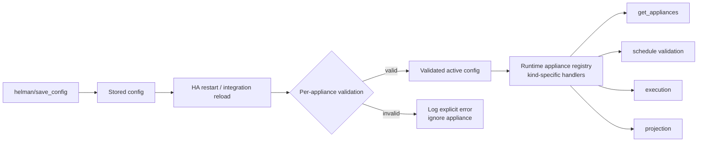
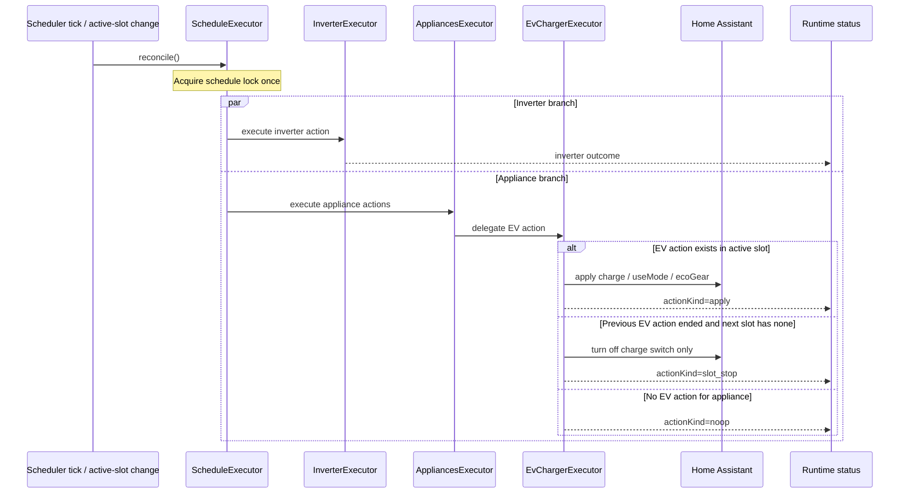
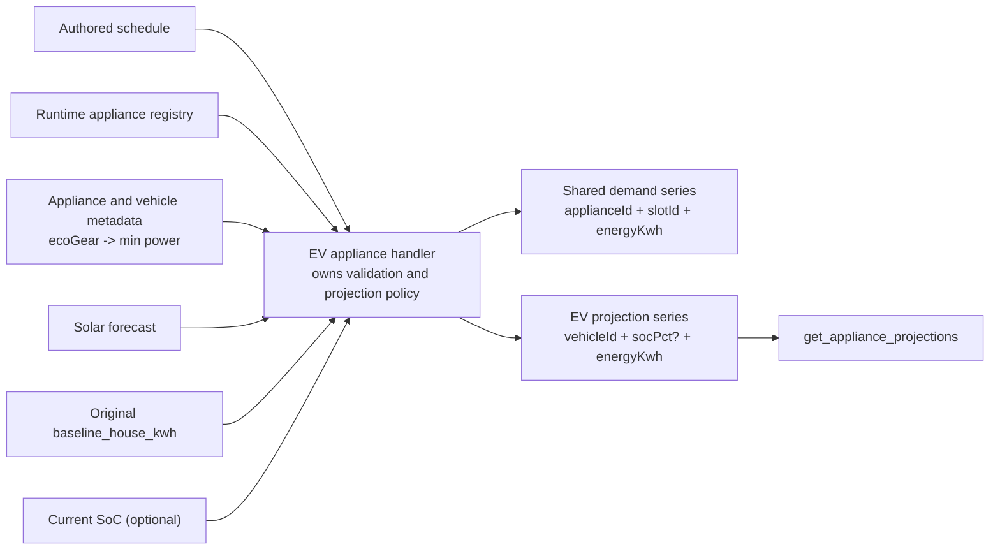
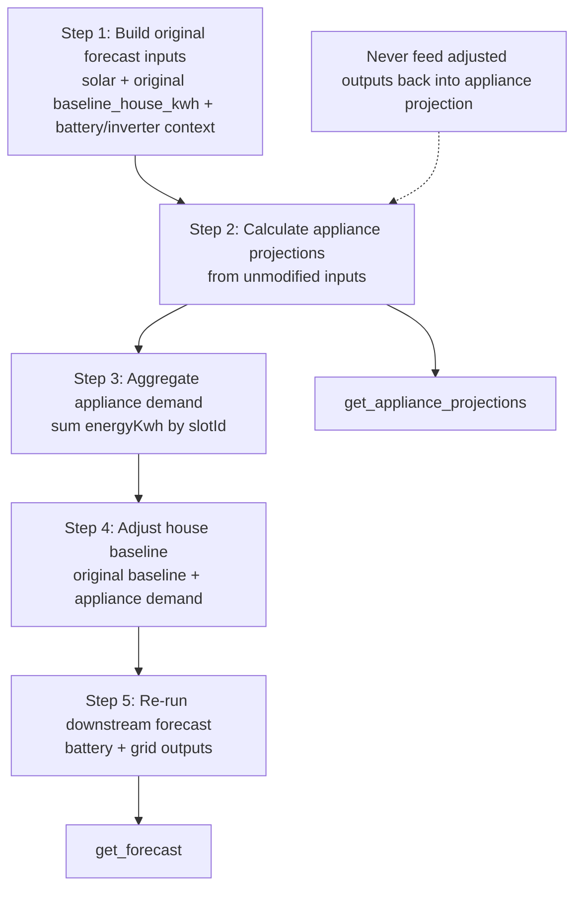

# EV / Appliances Architecture Summary

> Visual summary of the EV/appliances design already captured in this folder. Source of truth remains `ev-charger-feature-request-refined.md`, `ev-charger-implementation-shared.md`, and `stories/story-01` through `stories/story-06`.

## Core contract

- `appliances` is an umbrella schedule domain beside `inverter`.
- Runtime, schedule, and projection appliance collections are keyed by `applianceId`; EV actions additionally carry `vehicleId`.
- The shared cross-layer demand model is `applianceId + slotId + energyKwh`.

## 1. Config and runtime lifecycle

Runtime APIs operate on the runtime registry, not on raw stored config.

## 2. Action triggering and execution

Manual overrides are left alone until the next slot transition or an active-slot action change.

## 3. Projection flow

- `Fast`: `min(appliance max, vehicle max)`
- `ECO`: `min(effective_max_power, max(solar - baseline_house, eco_gear_min_power))`
- Missing SoC telemetry omits SoC projection, but still keeps `energyKwh`

## 4. Forecast integration pipeline

- Appliance demand is treated as additional house consumption.
- Forecast integration consumes only generic `energyKwh`; EV policy stays inside the EV handler.
- `get_appliance_projections` and `get_forecast` share the same one-pass computation and cache lifecycle.
- Live vehicle SoC changes do not invalidate the v1 projection/forecast cache.

## Locked invariants

- `charge = false` is authored schedule intent; `slot_stop` is runtime-only transition behavior.
- `slot_stop` turns off charging only; it keeps `useMode` and `ecoGear` unchanged.
- `slotId` is the canonical time key and `energyKwh` is the canonical shared energy field.
- The projection -> forecast pipeline is one-way and generic across appliance kinds.
