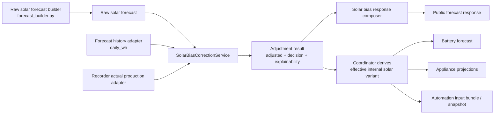
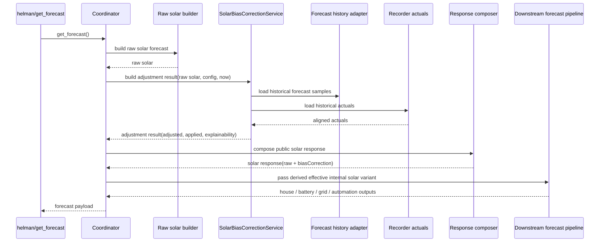
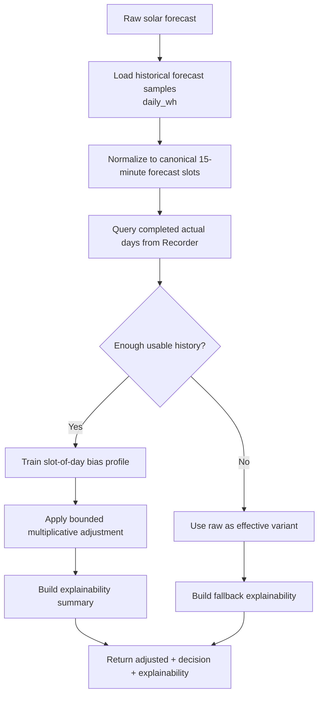
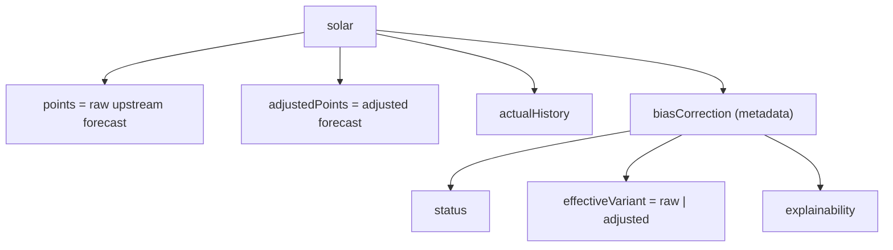

# Solar Forecast Bias Correction - Correction Engine Architecture

## Status

Architecture-focused companion to `solar-forecast-bias-correction-requirements.md`. The buildable v1 choices (persistence, daily scheduler, configurable clamp, default values, websocket endpoints, config-editor tab) live in `solar-forecast-bias-correction-v1-implementation-design.md` and supersede this doc wherever they overlap.

This document covers only:

- the correction engine boundary
- the response / explainability contract for that engine
- the integration seam between raw solar forecast building and downstream forecast consumers

This document does **not** cover:

- Home Assistant Energy re-exposure
- Helman consumer card visualization
- weather-aware correction

## Goal

Introduce a **cleanly isolated correction engine** that learns repeatable solar forecast bias from retained raw-vs-actual history, produces an adjusted forecast when confidence is sufficient, and makes that decision explicit in the public response without forcing downstream consumers to implement their own correction logic.

## Why this fits the current codebase

The current forecast stack already has the right shape for a dedicated correction-engine boundary:

- raw solar forecast building is isolated in `custom_components/helman/forecast_builder.py`
- canonical `15`-minute forecast shaping already exists in `custom_components/helman/point_forecast_response.py`
- `custom_components/helman/coordinator.py` already acts as the orchestration layer for forecast assembly and downstream fan-out
- persisted stores are centralized in `custom_components/helman/storage.py`
- downstream consumers already expect one effective solar input:
  - `battery_capacity_forecast_builder.py`
  - `appliances/projection_builder.py`
  - automation input bundle / snapshot assembly in `coordinator.py`

That means the correction engine can be introduced as a **derived forecast layer** rather than as a replacement solar builder or a downstream per-consumer feature.

## Architecture decision

Use a dedicated `solar_bias_correction` package with explicit boundaries for:

- forecast-history access
- actual-history access
- training
- adjustment
- orchestration
- response composition

The coordinator should remain a thin wiring layer. The correction engine should own feature-specific logic, and downstream consumers should continue to read **one effective internal solar variant**.

## Main design principles

### 1. Raw forecast remains first-class

The correction engine does not replace raw solar ingestion.

- `solar.points` remains the raw upstream forecast
- historical raw forecast samples remain the training truth
- adjusted output is derived from raw, not a new independent source

### 2. Canonical `15`-minute remains the internal reference model

The engine should operate on the same canonical `15`-minute grid the forecast stack already uses internally.

- raw source points may arrive hourly
- current response shaping already splits larger points onto the canonical grid
- trainer and adjuster should align to canonical local slots

### 3. One internal effective variant

Battery, appliance projection, and automation paths should not choose between raw and adjusted independently.

- the correction engine returns both raw and adjusted
- the engine also returns one effective internal solar variant
- downstream consumers use only that effective variant

### 4. Explainability is a first-class output

The engine should return enough metadata for API consumers and debugging surfaces to understand:

- whether correction was applied
- why it was or was not applied
- what model produced the result
- how much history supported the result

### 5. Derived data stays derived

In v1, the engine should prefer reusing existing Home Assistant historical data rather than creating a second mandatory history store.

- actual production remains sourced from Recorder
- forecast history is read from one selected forecast source kind
- trained bias profile remains derived from historical forecast + actual comparisons

### 6. One selected forecast-history source per trainer

V1 uses exactly one forecast-history source (`daily_wh`), normalized to canonical `15`-minute Wh slots before training. The trainer consumes only the normalized sample format — it does not know how history was captured or reconstructed. Concrete source selection, normalization, and capture rules live in the **Data inputs** section below.

## Data inputs

This section defines the trainer input contract, the selected v1 forecast-history source, and normalization rules. It is the authoritative place for data-input decisions; other docs reference it.

### Trainer input contract

The trainer receives only the **minimum canonical data** it needs to learn bias. Source reading, provenance, and normalization happen outside the trainer.

```json
{
  "forecastDate": "2026-04-19",
  "forecastPoints15m": [
    {"timestamp": "2026-04-19T00:00:00+02:00", "valueWh": 0.0},
    {"timestamp": "2026-04-19T00:15:00+02:00", "valueWh": 0.0}
  ],
  "actualPoints15m": [
    {"timestamp": "2026-04-19T00:00:00+02:00", "valueWh": 0.0},
    {"timestamp": "2026-04-19T00:15:00+02:00", "valueWh": 0.0}
  ]
}
```

| Field | Purpose |
| --- | --- |
| `forecastDate` | groups all slots belonging to one target day |
| `forecastPoints15m` | normalized forecast signal on canonical 15-minute slots |
| `actualPoints15m` | normalized target values on the same slots |
| local timezone-aligned timestamps | DST-safe alignment |

The history adapter may still keep richer source metadata (capture time, source entity, quality flags) for debugging or explainability, but the trainer must not require it.

### Actual solar production source

Per-slot actual production is derived from Home Assistant Recorder deltas of the cumulative production entity configured under `power_devices.solar.forecast.total_energy_entity_id`. This reuses the existing `forecast_builder.py` / `recorder_hourly_series.py` path and avoids a second actuals archive.

> The cumulative **actual** energy entity is grouped under the `forecast` config branch for historical reasons. It is an actuals source, not a forecast source; re-grouping the schema is out of scope for this feature but worth tracking. It must be a distinct entity from `daily_energy_entity_ids` (the forecast history source below).

### Forecast-history source — `daily_wh`

V1 uses one forecast-history source kind: `daily_wh`.

Read historical states of `sensor.energy_production_today` (the entity already consumed as today's daily forecast) from Recorder, and reconstruct historical `wh_period` snapshots from the recorded attributes. One capture per target day is enough for v1 — see the capture-selection rule below.

### Normalization rule

The history adapter normalizes all usable samples to the trainer format:

1. choose one forecast capture for one target day
2. parse the raw forecast values
3. align timestamps to local slot boundaries
4. expand or split forecast values to canonical `15`-minute slots when needed
5. derive comparable actual slot deltas
6. mark unusable or partial samples explicitly

This gives the trainer one stable input contract while keeping source-specific logic outside the processor.

### Capture-selection rule

For each target day, use the **earliest forecast capture after local midnight** of that day. One forecast capture per target sample.

This is a **same-day, day-start** capture (the `energy_production_today` entity for day D, read at the start of D), not a day-ahead capture. V1 learns the bias of the forecast available at the start of the target day; day-ahead learning (using the prior day's `energy_production_tomorrow` state) is a future extension that the trainer contract already accommodates.

One capture per day keeps the model explainable and avoids overweighting periods that happened to refresh more often.

## Current integration seam

Today the main solar path is:

1. `HelmanForecastBuilder._build_solar_forecast(...)` builds raw solar output from `daily_energy_entity_ids`
2. `build_solar_forecast_response(...)` reshapes that output to canonical or requested granularity
3. `HelmanCoordinator.get_forecast(...)` passes canonical solar into downstream forecast assembly
4. battery, appliance, and automation paths read `solar_forecast["points"]`

This creates one important constraint:

- the same solar payload shape currently acts as both the public response model and the internal consumption model

The correction engine architecture therefore needs an explicit split between:

- **public response contract**: raw + adjusted + explainability
- **internal effective forecast contract**: one solar series for downstream use

## System context



## Clean-architecture module boundaries

### Suggested package

```text
custom_components/helman/solar_bias_correction/
```

### Suggested modules

- `models.py`
- `forecast_history.py`
- `actuals.py`
- `trainer.py`
- `adjuster.py`
- `scheduler.py` — fires training at the configured local time-of-day (v1 addition; see v1 implementation design)
- `service.py`
- `response.py`
- `websocket.py` — thin handlers for `status`, `train_now`, `profile` (v1 addition; see v1 implementation design)

### Responsibilities

#### `models.py`

Owns the internal runtime objects used across the package.

Examples:

- historical forecast sample
- actuals window
- trained bias profile
- correction result
- explainability summary

#### `forecast_history.py`

Owns forecast-history access and normalization.

- read historical forecast data from the selected source kind
- support `daily_wh`
- normalize it to canonical local `15`-minute Wh slots
- expose minimal trainer samples to the processor

#### `actuals.py`

Owns Recorder-backed actual-history access for completed historical days.

- query actual solar production aligned to local slot boundaries
- normalize actuals to the same canonical slot model used by training
- keep Recorder access separate from trainer and adjuster concerns

#### `trainer.py`

Owns model training.

- consume only normalized trainer samples plus actual history
- filter unusable days
- train the v1 slot-of-day multiplicative bias profile
- report training metadata needed by explainability

The concrete training formula, numeric bounds, and edge-case handling are defined in `solar-forecast-bias-correction-model-design.md`.

#### `adjuster.py`

Owns adjusted-series generation.

- apply multiplicative slot factors to canonical raw points
- clamp unstable outputs
- preserve raw series unchanged
- return adjusted series plus adjustment summary

#### `service.py`

Owns orchestration.

- receive raw solar forecast input
- load normalized historical forecast samples
- load training inputs
- train or fallback
- apply correction when valid
- return only the adjustment decision and derived adjusted series

#### `response.py`

Owns the public correction payload shape.

- keep `solar.points` raw
- attach `solar.adjustedPoints`
- attach `solar.biasCorrection` metadata (`status`, `effectiveVariant`, `explainability`)

## Core runtime objects

| Object | Purpose | Persisted |
| --- | --- | --- |
| `TrainerSample` | One minimal normalized historical sample for the trainer | no |
| `SolarActualsWindow` | Recorder-backed actual production aligned to local canonical slots | no |
| `SolarBiasProfile` | Derived v1 slot-of-day multiplicative profile | no |
| `SolarBiasExplainability` | Compact metadata explaining apply / fallback decision | no |
| `SolarBiasAdjustmentResult` | Adjustment decision, adjusted series, and explainability | no |

## Request-time runtime flow



## Correction lifecycle



## Service contract

The correction service should conceptually accept:

- raw solar forecast
- bias-correction config
- reference time
- selected historical forecast source

And return:

- adjusted solar forecast when available
- whether adjustment was applied
- explainability metadata

The service should not:

- mutate the raw source series
- expose battery- or appliance-specific logic
- own Home Assistant Energy formatting

## Public response contract

The public solar response should preserve raw visibility while making correction explicit.



### Required response semantics

- `solar.points` remains the raw upstream forecast
- `solar.adjustedPoints` carries the adjusted forecast alongside raw (flat, not nested under metadata)
- `solar.biasCorrection.effectiveVariant` states which series downstream Helman logic used
- if adjustment is not applied, the raw forecast remains valid and `solar.biasCorrection.explainability` must say why

The explainability minimum contract is defined in `solar-forecast-bias-correction-requirements.md`. Optional detail (model identifier, history day counts, raw-vs-adjusted totals, compact factor summary) may be surfaced as implementation exposes it.

## Integration points in the current codebase

### Upstream boundary

`forecast_builder.py` remains responsible for:

- reading `power_devices.solar.forecast.daily_energy_entity_ids`
- parsing `wh_period`
- building raw solar `points`
- building today-so-far `actualHistory`

The correction engine sits **after** this raw build step.

### Coordinator boundary

`coordinator.py` remains responsible for:

- request orchestration
- cache wiring
- building the full forecast payload
- passing the effective solar variant into downstream forecast consumers

It should not absorb forecast-history / actuals / trainer / adjuster logic.

### Historical source boundary

See **Data inputs** above — `daily_wh` is the single v1 forecast-history source, normalized to the canonical `15`-minute trainer input format before it reaches the processor.

### Response boundary

`point_forecast_response.py` is currently a shallow point-forecast shaper. The correction-engine response layer should avoid overloading that helper with nested correction-specific semantics.

Instead:

- solar response composition should remain explicit
- nested correction metadata should be composed in a dedicated response module
- canonical granularity shaping for raw and adjusted series should stay consistent

### Downstream consumers

Current downstream consumers already read one solar series:

- `battery_capacity_forecast_builder.py` builds `solar_by_slot` from `solar_forecast["points"]`
- `appliances/projection_builder.py` builds `solar_by_slot_wh` from `solar_forecast["points"]`
- automation snapshot assembly carries solar in coordinator-owned context

The architecture should preserve that simplicity by passing only the **effective internal solar variant** downstream.

## Persistence boundary

V1 does not introduce a forecast-history archive, but **does** persist the derived bias profile so restarts don't force retraining.

### Selected v1 persistence direction

- use existing Home Assistant historical data for forecast history (no Helman-owned forecast archive)
- use Recorder for actual solar history
- persist the **derived profile** (factor map + metadata + training-config fingerprint) in Helman's existing `Store`; see `solar-forecast-bias-correction-v1-implementation-design.md` for the payload and fingerprint design

### What should stay out of persistence in selected v1

- duplicated actual solar archive outside Recorder
- mandatory Helman-owned forecast archive
- downstream consumer snapshots specific to correction logic

## Locked invariants

- the correction engine is a derived layer, not a replacement solar builder
- `solar.points` must stay raw
- downstream consumers must not each choose raw vs adjusted independently
- the effective internal variant must come from one correction-service decision
- the trainer must consume only minimal normalized samples
- actual solar history remains sourced from Recorder in v1
- training and adjustment align to local canonical slots
- fallback to raw is explicit and explainable, never silent

## Deliberate simplifications

- v1 uses a bounded slot-of-day multiplicative bias profile
- v1 does not include weather features
- v1 does not support multiple forecast-history source modes
- v1 persists a single derived profile (factor map + metadata + training-config fingerprint), not a multi-model registry
- this document does not cover Home Assistant Energy output shaping

## Implementation-facing file map

| Area | Current touchpoints | Planned correction-engine boundary |
| --- | --- | --- |
| Raw solar build | `forecast_builder.py` | stays unchanged as raw source |
| Config branch | `config_validation.py` | adds optional `power_devices.solar.forecast.bias_correction` subtree |
| Forecast history | HA forecast entity history | `forecast_history.py` reads `daily_wh` |
| Actual history | `recorder_hourly_series.py` | reused through dedicated actuals adapter |
| Orchestration | `coordinator.py` | wires correction service, passes effective variant |
| Public solar response | `point_forecast_response.py` + coordinator response assembly | explicit correction response composer |
| Internal consumers | battery / appliance / automation paths | continue to read one effective solar series |

## Trade-offs

| Choice | Benefit | Cost |
| --- | --- | --- |
| Dedicated correction service | keeps coordinator thin and logic isolated | adds package/module surface |
| Reuse existing forecast history | avoids mandatory duplicate storage | depends on historical data quality/retention |
| Derived profile kept non-durable | avoids stale-model persistence complexity | training may rerun more often |
| Public raw + adjusted response | preserves transparency | adds payload complexity |
| One effective internal variant | keeps downstream consumers simple | variant selection policy must be explicit |

## Considered, not selected options

- `current_hour` as a forecast-history source in v1
- `next_hour` as a primary forecast-history source
- mandatory Helman-owned raw forecast archive in v1
- hybrid archive fallback as part of the selected default design

## Recommendation

The correction engine should be implemented as a **dedicated application service with explicit forecast-history, actuals, trainer, adjuster, and response boundaries**. V1 should use `daily_wh` as the single forecast-history source, normalize it to the canonical `15`-minute trainer format, and keep the processor contract limited to the minimum normalized data it needs to do its job.
