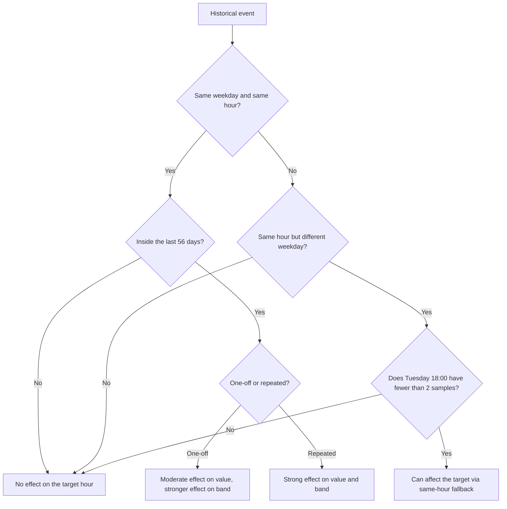

# House Consumption Forecast: How History Affects a Given Hour

This note explains how `hass-helman` turns Recorder history into the house consumption forecast and, more importantly, how unusual historical hours affect the final forecast for one specific future hour.

The current implementation lives in:

- `custom_components/helman/consumption_forecast_builder.py`
- `custom_components/helman/consumption_forecast_profiles.py`
- `custom_components/helman/consumption_forecast_statistics.py`

## TL;DR

- A future hour is forecast from the matching **weekday + hour** slot.
- Example: future **Tuesday 18:00** primarily uses past **Tuesday 18:00** values.
- The default history window is **56 days**.
- All historical samples inside that window have the **same weight**.
- The point forecast uses a **winsorized mean**:
  - compute raw `p10` / `p90` for the slot
  - clip each historical sample to that range
  - average the clipped samples
- The returned `lower` / `upper` band stays the **raw `p10` / `p90`**.
- A one-off peak or gap still affects the band, but affects the center less than a plain mean would.
- A different weekday usually does **not** matter, unless the target slot is sparse and falls back to the same hour across weekdays.
- A different hour does **not** affect the target hour.

## Model summary

| Item | Behavior |
| --- | --- |
| History source | Home Assistant Recorder hourly `change` statistics in `kWh` |
| Default training window | `56` days |
| Minimum required history | `14` days |
| Forecast horizon | `168` hours |
| Primary grouping | `weekday * 24 + hour` (`168` slots total) |
| Weighting | Equal weighting inside the training window |
| Point forecast | Winsorized mean using raw `p10` / `p90` clip bounds |
| Confidence band | Raw `p10` and `p90` from the selected sample pool |
| Sparse-slot fallback | If a slot has fewer than `2` points, use the same hour across all weekdays |
| Positive spikes | Still affect the band, but are clipped for the center |
| Low gaps / dips | Still affect the band, but are clipped for the center |
| Negative residuals | Tiny negatives are clamped to `0`; materially negative residual hours are dropped |

## How one forecast hour is built

```mermaid
flowchart TD
    A[Recorder hourly kWh change history] --> B[Read house total history]
    A --> C[Read deferrable consumer histories]
    B --> D[Compute non-deferrable residual = house total - sum(deferrables)]
    C --> D
    D --> E[Assign each hour to one weekday+hour slot]
    E --> F{At least 2 points in target slot?}
    F -- Yes --> G[Use only that weekday+hour slot]
    F -- No --> H[Fallback to same hour across all weekdays]
    G --> I[Compute raw p10 and p90]
    H --> I
    I --> J[Clip samples to p10-p90 and average them]
    J --> K[Return winsorized value plus raw lower and upper band]
```

## Decision guide for a target hour

The chart below answers: "Will this historical event affect the forecast for future Tuesday 18:00?"



## What counts as the "final forecast" for one hour

`hass-helman` does not forecast one monolithic house series and return that directly. It builds:

1. `nonDeferrable` from the residual `house total - sum(deferrable consumers)`
2. one forecast per configured deferrable consumer

The frontend then derives the displayed hourly total as:

```text
total = nonDeferrable + sum(deferrableConsumers)
```

That means a historical event can affect the final total in two different ways:

| Where the historical event appears | Which forecast component moves | Effect on displayed hourly total |
| --- | --- | --- |
| House total, not explained by deferrables | `nonDeferrable` | Total moves through the baseline component |
| One deferrable consumer, such as EV charging | That consumer's forecast row | Total moves by the same amount through that consumer |
| Multiple deferrable consumers at the same target hour | Multiple consumer rows | Total rises because the frontend sums all of them |

## Use cases and expected effect on the target hour

Assume the target is **future Tuesday 18:00**.

| Historical pattern | Affects future Tuesday 18:00? | Why | Typical effect on `value` | Typical effect on `upper` / `lower` | Notes |
| --- | --- | --- | --- | --- | --- |
| One spike on Tuesday 18:00 inside the 56-day window | Yes | Same slot | Modest upward pull | Stronger upward pull on `upper` | Winsorization reduces the spike's pull on the center |
| One unusually low Tuesday 18:00 hour inside the 56-day window | Yes | Same slot | Modest downward pull | Stronger downward pull on `lower` | Low outliers are clipped for the center too |
| One old spike still inside the 56-day window | Yes | Same slot | Similar effect to a recent spike | Similar effect | Age inside the window does not change the weight |
| One spike older than 56 days | No | Outside the training window | No change | No change | The sample is not queried anymore |
| Repeating spike every Tuesday 18:00 | Yes, strongly | Same slot repeated many times | Stable higher forecast | Stable higher upper band | Repeated behavior matters much more than one-off behavior |
| One spike on Wednesday 18:00 with healthy Tuesday history | Usually no | Different weekday, target slot already has enough data | No material change | No material change | The model does not mix weekdays when the target slot is not sparse |
| One spike on Wednesday 18:00 with sparse Tuesday history | Yes, possibly | Fallback pools all weekdays for the same hour | Can move upward | Can widen upward | Common in new or sparse installations |
| One spike on Tuesday 17:00 | No | Different hour, different slot | No change | No change | There is still no smoothing across adjacent hours |
| One EV charging spike on Tuesday 18:00 | Yes | The EV consumer profile for that slot moves | EV row rises, so total rises | EV upper rises, so total upper rises | The baseline does not absorb it if EV history explains it |
| House total is lower than sum of deferrables for one hour | That hour may be ignored | Residual becomes materially negative | That sample contributes nothing | That sample contributes nothing | The builder drops materially negative residual hours |

## Worked numeric examples

The examples below use the same ideas as the real implementation, but the numbers are rounded for readability.

### Example A: one same-slot peak in a mature slot

Assume the forecast is building a value for **future Tuesday 18:00** and there are already enough past Tuesday 18:00 samples, so no fallback is needed.

Historical samples in the selected slot:

| Week | Raw kWh value | Clipped value after raw `p10` / `p90` |
| --- | --- | --- |
| 1 | `2.1` | `2.1` |
| 2 | `1.9` | `1.9` |
| 3 | `8.0` | `3.94` |
| 4 | `2.0` | `2.0` |
| 5 | `2.2` | `2.2` |
| 6 | `2.1` | `2.1` |
| 7 | `1.8` | `1.87` |
| 8 | `2.0` | `2.0` |

For this slot:

```text
raw p10 = 1.87
raw p90 = 3.94
raw mean = 2.7625 kWh
winsorized center = 2.2638 kWh
```

If the `8.0 kWh` peak is removed, the same slot is roughly:

```text
reference center without the peak = 2.0143 kWh
```

So the one-off peak still raises the forecast, but much less than a plain mean would:

```text
plain mean with peak:      2.7625
winsorized center with peak: 2.2638
reference without peak:    2.0143
```

Practical takeaway:

- the spike still matters
- the spike matters **more** for `upper`
- the spike matters **less** for `value` than in the old mean-based model

### Example B: sparse Tuesday 18:00 slot falls back to all weekdays at 18:00

Now assume **future Tuesday 18:00** has only **one** past Tuesday 18:00 sample, so the model falls back to **18:00 across all weekdays**.

| Historical 18:00 sample in fallback pool | Raw kWh value | Clipped value after raw `p10` / `p90` |
| --- | --- | --- |
| Monday 18:00 | `2.2` | `2.2` |
| Tuesday 18:00 | `2.0` | `2.0` |
| Wednesday 18:00, unusual peak | `6.5` | `4.78` |
| Thursday 18:00 | `2.1` | `2.1` |
| Friday 18:00 | `1.9` | `1.94` |

For this fallback pool:

```text
raw p10 = 1.94
raw p90 = 4.78
winsorized center = 2.6040 kWh
```

If the Wednesday `6.5 kWh` peak is replaced by a normal `2.0 kWh` hour, the same pooled fallback is about:

```text
reference center without the spike = 2.0400 kWh
```

This is the key sparse-history behavior:

- with too few Tuesday 18:00 samples, a **Wednesday 18:00** peak can affect **Tuesday 18:00**
- once Tuesday 18:00 has at least two of its own samples, that Wednesday value is no longer part of the calculation

### Example C: one same-slot gap / low outlier

Consider a Tuesday 18:00 slot with a suspiciously low hour:

```text
raw samples = [0.1, 1.9, 2.0, 2.1, 2.2, 2.0, 1.8, 2.1]
raw p10 = 1.29
raw p90 = 2.13
raw mean = 1.7750 kWh
winsorized center = 1.9150 kWh
```

Practical takeaway:

- a low gap still pulls the center downward
- but the winsorized center resists it more than a plain mean
- the lower band still reflects that something unusually low happened

### Example D: effect on the final displayed total for one hour

The frontend derives the displayed total for the hour as:

```text
total = nonDeferrable + sum(deferrableConsumers)
```

So the final effect depends on which component the history changes.

| Scenario for future Tuesday 18:00 | Non-deferrable | EV charging | Pool heating | Displayed total |
| --- | --- | --- | --- | --- |
| Normal historical pattern | `1.8` | `0.4` | `0.0` | `2.2 kWh` |
| EV had repeated Tuesday 18:00 peaks in history | `1.8` | `1.6` | `0.0` | `3.4 kWh` |
| House total had repeated Tuesday 18:00 peaks, but EV did not | `3.0` | `0.4` | `0.0` | `3.4 kWh` |

Practical takeaway:

- if the peak belongs to a deferrable consumer, that consumer row rises and the final total rises by the same amount
- if the peak is unexplained by deferrables, the rise usually appears in `nonDeferrable`
- different components can produce the same displayed total, but the breakdown view will explain where the increase came from

## What the model does not do

| Not done by the model | Practical meaning |
| --- | --- |
| No weather input | Cold or hot days do not get special treatment unless the pattern is already visible in history |
| No schedule awareness | Planned future charging or appliance runs are not injected directly |
| No smoothing across neighboring hours | A peak at 17:00 does not bleed into 18:00 |
| No recency weighting inside the 56-day window | A sample from 7 days ago and 49 days ago count the same if both are still in the window |
| No weekday mixing when a slot already has enough data | Tuesday behavior stays mostly local to Tuesday |

## Practical intuition

If you want to predict what will happen to a specific future hour, ask these questions in order:

1. Is the historical event in the **same weekday and same hour**?
2. Is that event still inside the **last 56 days**?
3. Is it a **one-off** or a **repeating pattern**?
4. If it is not the same weekday, is the target slot sparse enough to trigger **same-hour fallback across weekdays**?
5. Did it happen in the **baseline residual** or in a **specific deferrable consumer**?

Those five checks usually tell you whether the final forecast for that hour will move a lot, a little, or not at all.
