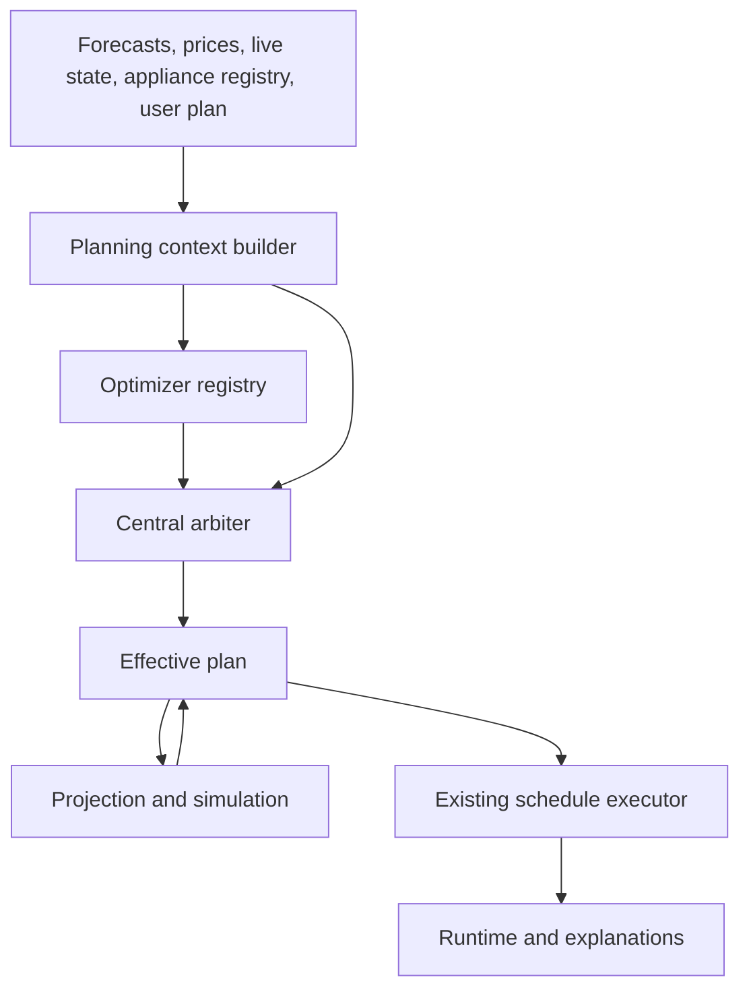
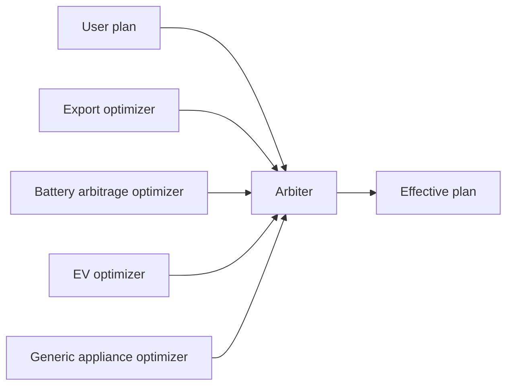
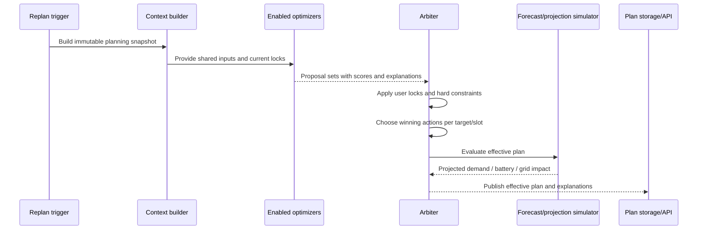

# Optimizer Architecture Overview

## Goal

This document sketches a high-level architecture for a new Helman feature that can automatically plan inverter actions and appliance actions per slot.

The target shape is:

- easy to plug in another optimizer module later
- keep manual user control as a first-class override
- stay explainable
- reuse the current Helman schedule, forecast, projection, and execution pipeline instead of replacing it

## Recommended direction

The cleanest direction is to keep **planning inside Helman** and treat Home Assistant native automations as an optional integration layer around it.

At a high level:

1. Helman builds one shared planning context from forecasts, prices, live device state, and user-authored actions.
2. Each optimizer is independently enabled or disabled and produces **slot action proposals**, not direct side effects.
3. A central arbiter builds one **effective plan** using hard locks first and score/cost comparison second.
4. The effective plan is what feeds existing projection, forecast, and execution behavior.

That keeps the system modular without making each optimizer responsible for cross-feature coordination.

## Why this fits the current codebase

This direction matches the current Helman shape well:

- there is already a sparse slot-based schedule model
- the executor already knows how to apply inverter and appliance actions
- the appliance projection pipeline already turns slot actions into forecast demand
- battery and grid-flow forecast already react to schedule overlays
- runtime is already kept separate from authored schedule state

Two current behaviors are especially useful for this design:

1. **Missing slot data already means "no explicit action".** Helman stores sparse schedule data and materializes defaults later.
2. **Missing action should stay absent, not `null`.** For this feature, that is the right model too: absence means "open for automation" or "falls back to default behavior".

In practice that means:

- missing inverter action => implicit `normal`
- missing appliance action => no scheduled action for that appliance in that slot
- no need to store `null` actions just to say "nothing here"

## Core principles

### 1. User-authored actions are hard locks

If an action is authored by the user, automation cannot override it.

### 2. Automation is modular, not monolithic

Each optimizer should focus on one decision family:

- negative export protection
- battery price arbitrage / charge-shift
- EV charging
- generic appliance scheduling

### 3. Hard constraints come before scoring

The arbiter should never "score its way around" safety, device capability, or user locks.

### 4. Explainability is part of the plan model

Every automation-produced action should carry enough metadata to explain:

- which optimizer proposed it
- why it won
- what main trade-off it represents

### 5. Separate source layers from the effective plan

Externally it is fine for the chosen action to expose `author: user | automation`.

Internally, the cleaner model is to keep separate logical layers:

- user-authored plan
- optimizer proposals or optimizer-owned plan layers
- effective merged plan

That preserves sparse "absence" semantics and keeps conflict resolution understandable.

### 6. Prefer one planning brain, many strategy modules

Optimizers should not directly rewrite storage or call device services.

They should only propose actions. Coordination belongs in one place.

## Proposed planning layers

## Recommended logical plan model

| Layer | Purpose | Mutability |
| --- | --- | --- |
| Baseline context | Immutable view of forecasts, prices, battery, appliance state, config | Rebuilt on each planning run |
| User plan | Sparse slot actions explicitly authored by the user | Stable until the user changes it |
| Optimizer plans | Sparse actions proposed by each enabled optimizer | Recomputed by automation |
| Effective plan | Final merged plan with chosen actions and authorship | Derived |
| Runtime | What actually happened in the active slot | Ephemeral |

### Action ownership

The useful ownership rule is:

- `author = user` means locked
- `author = automation` means automation may replace it on later replans
- missing action means no explicit claim

The important nuance is that **`author` belongs on the chosen action**, but the system should still remember which optimizer produced it.

Recommended metadata on effective automation actions:

- `author`
- `optimizerId`
- `score`
- `reasonCode`
- `explanationRef` or inline explanation summary

## Recommended cooperation model

Each optimizer should think in terms of **targets**, not whole-plan ownership.

A target is one of:

- inverter action for a slot
- appliance action for one appliance in a slot

That gives the arbiter a clean comparison surface:

- compare inverter proposals with other inverter proposals for the same slot
- compare EV proposals with other EV proposals for that EV slot
- compare pool-heating proposals with other pool-heating proposals for that slot

This keeps optimizers focused and avoids hidden coupling.

## Arbitration model

The arbiter should resolve actions in this order:

1. **User locks**
2. **Physical and policy constraints**
3. **Score/cost comparison between remaining automation proposals**
4. **Deterministic tie-breakers**

Recommended tie-breaker direction:

1. higher score wins
2. lower risk wins
3. narrower scope wins
4. stable previous winner wins
5. lexical optimizer ID wins as the final deterministic fallback

The score itself should be comparable across optimizers, but the system should keep a **score breakdown**, not just one number.

Typical score components:

- expected cost impact
- expected export/import impact
- expected self-consumption gain
- reserve / battery readiness penalty
- appliance completion or deadline penalty
- confidence penalty for weak or missing inputs

## Recommended planner pipeline

Recommended trigger sources:

- forecast refresh
- major price update
- battery SoC shift
- EV SoC or charge-limit update
- optimizer enable/disable change
- user plan change
- explicit Home Assistant automation trigger

## Recommended optimizer contract

Each optimizer should plug in through one small contract.

High-level interface:

- `id`
- `enabled`
- `supportedTargets`
- `requiredInputs`
- `buildProposals(context) -> Proposal[]`
- `summarize(proposal, context) -> Explanation`

Each proposal should describe:

- target slot or slot range
- target key (`inverter` or `appliance:<id>`)
- action payload
- score and score breakdown
- assumptions
- explanation summary

That is enough to add a new optimizer module without changing the whole planning pipeline.

## Suggested first optimizer families

### Negative export protection

Purpose:

- prevent exporting when export price is negative
- optionally prefer storing energy locally or shifting load into that window

Typical targets:

- inverter
- flexible appliances that can absorb surplus

### Battery price arbitrage / charge-shift

Purpose:

- charge when import is cheap or when later solar is strong enough to justify holding capacity now
- avoid charging when export is temporarily valuable and later charging is cheaper or solar-rich

Typical targets:

- inverter only in the first slice

### EV charging optimizer

Purpose:

- combine EV SoC, charge limit, max power, cheap import windows, and solar surplus

Typical targets:

- one EV appliance per slot

### Generic appliance optimizer

Purpose:

- schedule pool heating, boiler, or other flexible loads against price and solar windows

Typical targets:

- individual appliance slots

## Storage recommendation

At the architecture level, the cleanest model is to treat plan layers separately even if the first implementation decides to serialize them together later.

Recommended logical storage:

- `user_plan`
- `optimizer_plan_layers[optimizerId]`
- `effective_plan`

Why this is cleaner than one mutable mixed document:

- user locks stay untouched
- optimizer-owned actions can be fully recomputed
- "missing action" stays naturally absent
- explanations and provenance stay attached to the producing optimizer

### Important answer to the current sparse-slot question

For undefined actions, keep the current Helman semantic:

- **do not store `null`**
- **do not create placeholder actions**
- **store only explicit actions**
- **materialize defaults when building the full slot view**

That keeps the planner simple and matches the current schedule behavior.

## API and UI direction

The most natural surfaces are:

- schedule API for authored, automation, and effective slot actions
- forecast API for plan-adjusted economic and battery impact
- runtime API for actual execution status

Recommended API shape direction:

- keep `runtime` separate from authored/effective plan data
- expose effective actions with `author`
- expose optimizer provenance and explanation metadata next to automation actions
- eventually expose both baseline and plan-adjusted economics

For UI/config, the current editor shape suggests:

- optimizer config belongs under `scheduler`
- appliance-specific optimizer settings belong with `appliances`
- price/forecast provider details stay under `power_devices`

## Home Assistant native automation: where it fits

Home Assistant automations are a good **integration layer**, but a poor primary planning engine for this feature.

Good fits:

- trigger replanning
- temporarily enable or disable an optimizer
- inject one-off directives
- notify the user about proposed or changed plans
- request approval for specific automation actions

Poor fits:

- multi-slot forecast-aware optimization
- score-based conflict resolution
- economic comparison across several candidate plans
- consistent explainability and provenance

So the recommended position is:

- **Helman owns planning**
- **Home Assistant automations can steer Helman**

## Strong recommendation on time grids

Current Helman already has two time grids:

- forecast logic is naturally more granular
- execution schedule is slot-based

The high-level direction I recommend is:

- use a **canonical internal planning grid** for optimizer reasoning
- compile the chosen effective plan down to the current executable slot model

That keeps optimizers aligned with pricing and forecast detail without forcing the whole execution model to change immediately.

## What this architecture avoids

This design intentionally avoids:

- one giant optimizer that knows everything
- optimizers mutating storage directly
- encoding user locks and automation output in the same mutable blob without provenance
- relying on Home Assistant automations for the core optimization logic
- storing `null` actions to represent "nothing"

## Open topics for the next deeper pass

When going from high-level architecture to design detail, the most useful next topics are:

1. exact plan DTO shape for `user_plan`, `optimizer_plan_layers`, and `effective_plan`
2. score schema and explanation schema
3. the first optimizer contract in code
4. whether the first implementation persists per-optimizer layers or only the effective plan
5. how plan-adjusted economics should appear in forecast responses
