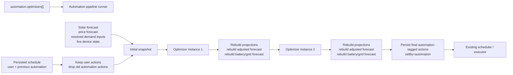
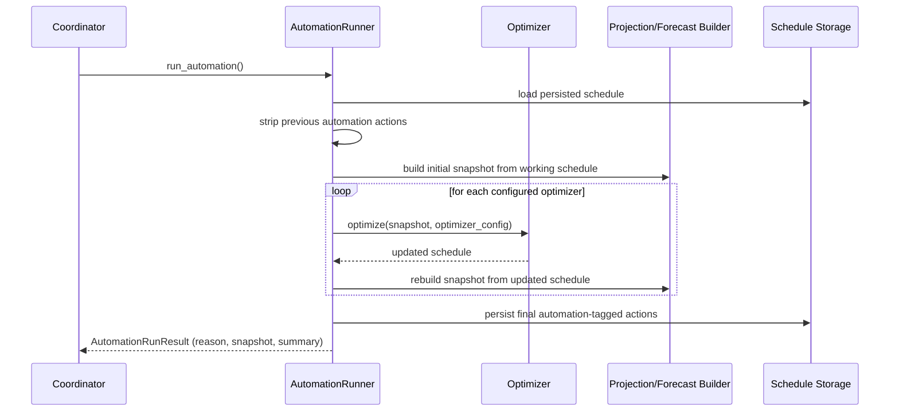

# Helman Automation - Optimizer Pipeline Architecture

## Goal

Add automation on top of the existing schedule, execution, appliance projection, and forecast pipeline without introducing a second planning model.

The simplest shape is an **ordered pipeline of small optimizers**:

- each optimizer is configured as one instance in config
- instances run in config order
- every optimizer sees the same snapshot shape
- every optimizer only changes the schedule
- the framework rebuilds projections and forecast after each optimizer
- only the final automation result is persisted by the run

## Refined core idea

The schedule should stay the only durable plan artifact.

Automation should work like this:

1. load the persisted schedule
2. remove the previous automation-produced actions
3. build an in-memory working schedule
4. rebuild the derived forecast snapshot from that working schedule
5. run optimizer 1
6. rebuild projections and forecast from the updated working schedule
7. run optimizer 2
8. rebuild again
9. after the last optimizer finishes, persist the final result back into the schedule

That keeps the system simple because there is only one real thing being edited: **the working schedule**.

Projections and forecast are still part of the optimizer input/output view, but they are **derived products** rebuilt by the pipeline runner, not hand-authored by each optimizer.

## Why this fits the current codebase

The current backend already has the right pieces:

- persisted `ScheduleDocument`
- schedule execution and reconciliation
- appliance projection building from schedule
- adjusted house forecast built from projected appliance demand
- battery/grid forecast built from the adjusted forecast

So automation can be added as a new orchestration layer on top of the current schedule pipeline instead of as a parallel system.

## Main design principles

### 1. One canonical mutable artifact

Optimizers mutate only the schedule.

They do **not** directly mutate:

- appliance projections
- adjusted house forecast
- battery forecast
- grid forecast

Those outputs are recalculated after every optimizer step.

### 2. Uniform optimizer contract

Every optimizer gets the same input shape and participates in the same loop.

An optimizer should not know:

- which optimizer ran before it
- which optimizer runs after it
- whether another optimizer is enabled or disabled

The only dependency model is the **order in config** and the snapshot it receives.

### 3. Ephemeral intermediate state

Intermediate optimizer outputs stay in memory only.

If optimizer 2 fails, nothing from optimizer 1 should be partially persisted. The automation run should write only after the whole run succeeds.

### 4. Manual and automation actions must coexist

The existing `setBy` metadata should separate user-authored actions from automation-authored actions.

Ownership is **per action position inside a slot**, not per whole slot.

For the current schedule model, the relevant ownership keys are:

- `(slot_id, "inverter")`
- `(slot_id, "appliances", appliance_id)`

That means one slot may legitimately contain a user-owned inverter action and separate automation-owned appliance actions, or the reverse.

This must be treated as a hard invariant:

- **automation must never overwrite a user-defined action at any ownership key**
- if a specific action position already contains `setBy=user`, or contains an explicit authored action whose `setBy` is missing, automation must leave that position untouched
- automation may only add, replace, or remove its own `setBy=automation` actions

That gives this simple persistence rule:

- keep all user-owned actions as the baseline, including explicit authored actions whose `setBy` is missing
- remove old `setBy=automation` actions on every automation run
- write new automation-produced actions back with `setBy=automation`

When automation produces a replacement action, the merge/persistence path should force-stamp `setBy=automation` on that emitted action. It should not rely on the existing user-edit stamping helpers that intentionally preserve pre-existing ownership metadata.

In other words, manual user actions are absolute ownership of their specific action keys. Automation is additive-only around them and can refresh only its own action keys every run.

Compatibility rule for existing stored schedules:

- if a slot contains an explicit authored action but no `setBy`, treat it as user-owned for overwrite protection
- implicit default / empty positions remain writable
- v1 should not require an eager storage rewrite just to stamp old entries; the existing schedule normalization path can continue to normalize metadata opportunistically on later user edits if it already does so

Migration note: older persisted authored actions without `setBy` stay protected as user-owned until a later explicit rewrite updates that metadata; automation must not backfill or reinterpret them as writable gaps.

For v1 this means:

- `export_price` may write only `domains.inverter`, and only when that inverter action is empty or already automation-owned
- `surplus_appliance` for a generic appliance such as `boiler`, or for a climate appliance, may write only `domains.appliances[appliance_id]`, and only when that appliance action is empty or already automation-owned
- neither optimizer should treat the whole slot as blocked just because some other key in that slot is user-owned

### 5. Framework owns recomputation and validation

The pipeline runner should own:

- reuse of the existing schedule lock for the full decision + final-save portion of the read-modify-write cycle
- sourcing a coordinator-owned forecast input bundle from the last successful refresh, including the fixed original house forecast baseline, canonical solar forecast, canonical grid price forecast, and `when_active_hourly_energy_kwh_by_appliance_id` for eligible generic/climate appliances
- schedule normalization and validation
- projection rebuild
- adjusted forecast rebuild
- battery/grid forecast rebuild
- final persistence

Optimizers should stay focused on decision logic only.

They should consume the already rebuilt forecast view and should not read projection outputs directly. Projection logic remains an internal pipeline step used to refresh the forecast after schedule changes.

The runner should also reuse the existing schedule validation boundary instead of inventing a new one. Optimizer output should still pass through the existing schedule normalization path so the current rules stay authoritative:

- slot alignment
- rolling horizon limits
- SoC bounds
- appliance-specific strict validation

For automation-produced changes, the framework should validate those changes strictly before merge using the same slot/domain rules as user-authored writes, then run the final merged document through the normal persisted-schedule normalization path. Do not rely on the load/prune persistence path alone to silently discard optimizer mistakes.

The final write should also reuse the same schedule persistence and post-write side-effect path that user-authored `set_schedule` uses, so public forecast and appliance-projection endpoints observe the same cache invalidation and recomputation behavior after automation writes. Save while holding the schedule lock, then release the lock before running the shared post-write side effects, matching the current `set_schedule` flow and avoiding re-entrant schedule locking.

Any recorder-backed or other async inputs needed for demand-profile resolution are also framework-owned. They should be resolved once when the refresh path captures the bundle or once when a run pins that bundle, not during rebuild steps. That pre-resolution must iterate the eligible appliance registry directly rather than reusing the current schedule-driven history helper, so unscheduled candidate appliances are still present in the pinned demand-input map. Optimizers stay synchronous decision functions and do not perform fresh I/O themselves.

### 6. Automation runs only when schedule execution is enabled

For v1, optimizer decision runs should happen only when all of the following are true:

- top-level `automation.enabled` is true
- schedule execution is enabled
- at least one optimizer instance is enabled after config parsing

This is an architectural rule, not just an implementation detail. The current forecast pipeline reflects schedule effects only in execution-enabled mode, so allowing automation to run while execution is disabled would make the between-optimizer rebuild misleading.

If execution is disabled, the simplest v1 behavior is:

- do not run optimizer decision logic
- on transition `execution_enabled: true -> false`, perform a one-shot cleanup that strips persisted `setBy=automation` actions and saves the cleaned schedule
- after that cleanup, future triggers short-circuit while execution remains disabled

If execution is enabled but `automation.enabled=false` or no enabled optimizer instances remain, v1 should also avoid optimizer decision logic and instead allow a **cleanup-only** pass that strips stale automation-owned actions and persists only if the schedule actually changed. This keeps stale automation state from lingering on disk after automation is disabled in config.

The simplest cleanup-only persistence rule is: compare the loaded baseline with the stripped schedule and save the stripped version through the normal persistence path only when those two documents differ.

When execution is enabled, the v1 trigger set should be:

1. **integration startup or reload**, after config and persisted schedule have been loaded
2. **immediately after schedule execution is turned on**
3. **after each slot-aligned forecast refresh completes**, so automation uses the newest rebuilt forecast inputs; with the current coordinator schedule this means after the `00/15/30/45` refresh cycle
4. **immediately after a successful user-authored schedule update**, so automation-owned actions can adapt around the new manual action without waiting for the next slot boundary

Two guardrails should be explicit:

- repeated user edits should be **coalesced into one rerun** rather than starting a fresh full pipeline run after every individual write
- the automation run should **not retrigger itself** from its own final persistence write
- startup/reload and slot-refresh should queue automation only after a successful forecast refresh has produced usable inputs
- if a new trigger arrives while a run is already active, coalescing may collapse bursts, but a follow-up rerun must still remain queued after the active run if newer inputs arrived
- holding the schedule lock for the automation decision + final-save portion is the accepted v1 trade-off for correctness; user-authored writes may briefly wait behind automation work, but the shared post-write side effects should run after the lock is released

Manual or debug invocation surfaces should return an `AutomationRunResult` that distinguishes `execution_disabled`, `automation_disabled`, `no_enabled_optimizers`, and `cleanup_only`, and should include cleanup metadata such as how many automation-owned actions were stripped when cleanup actually changed the schedule.

When a run does produce a snapshot, the forecast sections in that snapshot should preserve the underlying pipeline status rather than being forced to `"available"`. In practice a valid debug snapshot may therefore carry `battery_forecast.status == "partial"` (and the derived grid forecast built from it) when the existing forecast pipeline only has partial upstream coverage.

`AutomationRunResult` is diagnostic metadata about the attempted run. If one optimizer fails, the result may still report earlier optimizers as `"ok"` for observability, but no optimizer output from that failed run is persisted.

### 7. Existing schedule boundaries still apply

Automation should not define its own writable window. It operates inside the same schedule boundaries that already exist:

- only schedule positions defined by the existing scheduler model, whose slot duration is controlled by `SCHEDULE_SLOT_MINUTES`; automation logic must derive slot boundaries from that constant and must not hard-code 30-minute slots
- only within the rolling scheduling horizon from `now`
- only values that pass the existing schedule and appliance normalization rules

The current code happens to use `SCHEDULE_SLOT_MINUTES=30` while forecast inputs are rebuilt on canonical `FORECAST_CANONICAL_GRANULARITY_MINUTES=15` buckets, but the architecture intentionally treats authored schedule slot size as constant-driven rather than fixed. When an optimizer reasons about one authored schedule slot against forecast buckets, it should derive the covered forecast buckets from `SCHEDULE_SLOT_MINUTES` and the canonical forecast granularity instead of assuming that one authored slot is always two 15-minute buckets.

The automation run should therefore be understood as "produce a candidate schedule update, then let the existing schedule rules accept or reject it".

Also note that the schedule store may still change outside an automation run because the existing executor can prune expired entries while reconciling. So "only the final pipeline result is persisted" applies to the automation run's own edits, not to schedule storage globally.

## Core runtime objects

| Object | Purpose | Persisted |
| --- | --- | --- |
| `ScheduleDocument` baseline | User-authored schedule plus execution flag | yes |
| `AutomationInputBundle` | Coordinator-owned cached refresh snapshot pinned at run start; carries original house baseline, solar, price, and resolved per-appliance demand inputs | no |
| Working schedule | In-memory candidate being transformed by optimizers | no |
| `OptimizationSnapshot` | Working schedule + rebuilt forecast view + live context | no |
| Optimizer instance | One configured plugin instance with kind, id, enabled flag, and params | config only |
| `AutomationRunResult` | In-memory result envelope for trigger-driven or manual runs; distinguishes ran / skipped / cleanup-only outcomes and may carry the final snapshot and summary metadata | no |
| Automation-tagged actions | Persisted schedule actions marked `setBy=automation` | yes |

## Pipeline flow



## Optimizer contract

Conceptually, every optimizer works with the same snapshot:

```text
OptimizationSnapshot
- schedule
- adjusted_house_forecast
- battery_forecast
- grid_forecast
- context
  - now
  - current battery state
  - solar forecast
  - import/export price forecast
  - appliance_registry
  - when_active_hourly_energy_kwh_by_appliance_id
```

The important simplification is:

- **read everything**
- **write only the schedule**

So the practical contract can stay small:

```text
next_schedule = optimizer.optimize(snapshot, config)
next_snapshot = runner.rebuild(next_schedule)
```

This still preserves the mental model that every optimizer receives the same in/out view, while keeping implementation safe and deterministic.

Optimizers must treat `snapshot.schedule` as immutable input and return a new `ScheduleDocument`. They should not mutate the provided working schedule in place, and the framework/tests should treat in-place mutation as a contract violation.

The runner may still use the existing projection pipeline internally during `rebuild()`, but that remains framework-owned. Optimizers should rely on the resulting forecast, not on appliance projection payloads, so calculation logic stays in one place.

`OptimizationSnapshot.context.appliance_registry` is the canonical capability surface for optimizers in v1. `context.when_active_hourly_energy_kwh_by_appliance_id` is the canonical pinned demand-input surface. A separate `appliance_capabilities` payload is unnecessary unless a later serialization boundary forces that split.

At a high level, that rebuild should follow the existing backend flow:

1. start from the fixed solar + original unadjusted house forecast + grid price + resolved demand-input bundle captured from the last successful forecast refresh
2. derive appliance demand effects from the working schedule using that pinned bundle rather than performing fresh recorder reads
3. fold that demand into the original house forecast to produce the adjusted house forecast
4. apply any inverter schedule effect through the existing battery forecast overlay path, including the same battery-forecast schedule filtering rules the public forecast path uses for unsupported charge/discharge target-SoC actions
5. produce battery forecast, then compose grid forecast from battery-derived grid flow plus the cached price-forecast inputs from the same refresh bundle

The key Phase 3 invariant is that the runner reuses the existing rebuild pipeline faithfully. If that pipeline yields `available`, `partial`, or another non-error forecast status, the automation snapshot should surface that same status instead of normalizing it away.

Optimizers should see only the rebuilt result, not reimplement any part of that chain themselves.

## Sequence



## Suggested v1 optimizer kinds

### 1. `export_price`

Purpose:

- avoid exporting energy when export economics are bad, especially during negative price windows

Reads:

- export price forecast
- working battery/grid forecast
- current schedule state

Writes:

- inverter schedule actions for affected slots

Likely v1 action choice:

- prefer existing `stop_export` where the configured inverter control supports it
- otherwise skip the affected slot and log a warning; v1 should not guess an alternate inverter action whose semantics have not been agreed explicitly

### 2. `surplus_appliance`

Purpose:

- start a configured generic or climate appliance when enough forecast surplus is available

Reads:

- working schedule
- adjusted house forecast after previous optimizers
- battery/grid forecast after previous optimizers
- appliance when-active demand profile resolved through shared logic next to the existing projection builder, using `context.when_active_hourly_energy_kwh_by_appliance_id`
- appliance capabilities and configured thresholds

Writes:

- appliance schedule actions for one configured appliance instance

V1 scope and authored output:

- v1 is intentionally **start-only**; it does not author explicit "off" actions when surplus later disappears
- generic appliances emit the existing authored DTO `{ "on": true }`
- climate appliances emit the existing authored DTO `{ "mode": climate_mode }`
- for climate appliances, config requires `climate_mode`; in the current backend that means `heat` or `cool`
- EV charging is intentionally out of scope for this optimizer kind in v1

Important detail:

This optimizer should look at **remaining surplus after previous optimizer effects**, not at raw solar alone. That is exactly why the pipeline should rebuild the snapshot between optimizer steps.

It should **not** read appliance projections as an input. Projections are created only after schedule actions exist, so using them for this optimizer would duplicate calculation logic and create a circular dependency. The optimizer should instead use the already rebuilt forecast plus the appliance's own expected when-active consumption profile.

The required surplus should be derived automatically from that demand profile, not configured as a fixed `min_surplus_kw`. An optional buffer still makes sense, for example `min_surplus_buffer_pct` with a default of `5`, so the optimizer requires a bit more forecast surplus than the appliance is expected to consume.

That demand profile should come from one shared helper next to the existing projection logic so generic and climate appliances resolve through one framework-owned path instead of drifting into per-optimizer logic branches.

If that helper depends on recorder-backed history data, the runner/framework should resolve those inputs before the optimizer decision step and pass the helper already-resolved data. The helper must work for candidate appliances that are not yet scheduled, not only for appliances already present in the current schedule. The optimizer itself should not perform async I/O.

For each authored schedule slot sized by `SCHEDULE_SLOT_MINUTES`, the optimizer should evaluate all covered `FORECAST_CANONICAL_GRANULARITY_MINUTES` forecast buckets and write the slot only if **every** covered bucket satisfies the buffered surplus requirement. This keeps slot mapping derived from the same scheduler and forecast constants the rest of the backend uses rather than assuming a fixed 30-minute slot shape.

## Suggested config shape

```yaml
automation:
  enabled: true
  optimizers:
    - id: avoid-negative-export
      kind: export_price
      enabled: true
      when_price_below: 0.0
      action: stop_export

    - id: run-boiler-on-surplus
      kind: surplus_appliance
      enabled: true
      appliance_id: boiler
      action: on
      min_surplus_buffer_pct: 5

    - id: preheat-living-room
      kind: surplus_appliance
      enabled: true
      appliance_id: living_room_climate
      action: on
      climate_mode: heat
```

Notes:

- list order is execution order
- multiple instances of the same kind are allowed
- disabling an optimizer should simply remove it from the run without changing the contract for the others
- use `action` consistently across optimizer kinds for the schedule effect the optimizer wants to produce; for `surplus_appliance`, `action: on` is a v1 start-only semantic, not a promise of symmetric off-handling
- for `surplus_appliance`, `climate_mode` is required for climate appliances and forbidden for generic appliances
- `min_surplus_buffer_pct` is optional and defaults to `5`; the actual required surplus is derived from the appliance demand profile plus this buffer
- if two optimizers target the same ownership key, later config order wins by design

## Suggested package shape

```text
custom_components/helman/automation/
  __init__.py
  input_bundle.py
  config.py
  pipeline.py
  snapshot.py
  optimizer.py
  optimizers/
    export_price.py
    surplus_appliance.py
```

Responsibilities:

- `input_bundle.py`: define the refresh-derived automation input bundle pinned at run start
- `config.py`: validate optimizer config and instantiate ordered optimizer instances
- `snapshot.py`: define the uniform snapshot structure
- `optimizer.py`: base protocol for optimizers
- `pipeline.py`: orchestration, rebuild loop, persistence, error handling
- `optimizers/*.py`: optimizer-specific decision logic only

## Integration with the current backend

The cleanest integration point is still the coordinator.

Recommended shape:

1. coordinator refresh logic maintains the latest `AutomationInputBundle` from house + solar + price + resolved per-appliance demand inputs
2. coordinator triggers automation run from startup/reload, execution-enable, slot-aligned forecast refresh completion, and successful user-authored schedule updates
3. automation runner acquires the existing schedule lock
4. automation runner builds the working schedule baseline and pins the current input bundle for the duration of the run
5. automation runner reuses the existing schedule -> projections -> adjusted forecast -> battery/grid forecast flow
6. final result is validated through the existing schedule normalization path and then written back through the same schedule persistence / post-write side-effect path that user-authored `set_schedule` uses, with the side effects executed after the schedule lock is released
7. existing schedule execution continues to execute the persisted result

A useful internal refactor would be to extract the current "build derived outputs from a schedule document" logic into a reusable helper that both:

- forecast APIs
- automation pipeline

can call.

## Deliberate simplifications

These constraints keep the architecture understandable:

- no optimizer-to-optimizer custom APIs
- no partial persistence between optimizer steps
- no optimizer directly calling Home Assistant services
- no optimizer manually editing forecast payloads
- no optimizer-specific cache format
- no dependency graph; config order is enough
- `setBy` is used only for ownership in v1; if per-optimizer attribution is needed later, add separate metadata rather than overloading `setBy`

## One important behavioral choice

For the first version, the simplest rule is:

- automation writes into the existing schedule model
- optimizer decision runs happen only when `automation.enabled` is true, schedule execution is enabled, and at least one optimizer instance is enabled
- disabling schedule execution strips automation-owned actions once instead of preserving stale automation state on disk
- disabling automation (or ending up with zero enabled optimizer instances) allows a cleanup-only removal of stale automation-owned actions rather than keeping them indefinitely
- existing schedule execution semantics stay in charge of whether that plan affects projections and execution

That keeps automation aligned with current behavior. If later you want "review-only automation drafts", that can be added as a separate layer, but it does not need to exist in the first architecture slice.

## Recommendation

The best simple mental model is:

**automation is a schedule transformer pipeline**

where:

- config defines ordered optimizer instances
- each optimizer reads the same snapshot shape
- each optimizer writes only schedule changes
- the framework rebuilds projections and forecast after every step
- only the final pipeline result is persisted
- automation-owned actions are refreshed by `setBy=automation`, while manual user actions stay intact

That gives you a plugin-like system that is easy to extend later with new optimizer kinds without changing the core pipeline contract.
